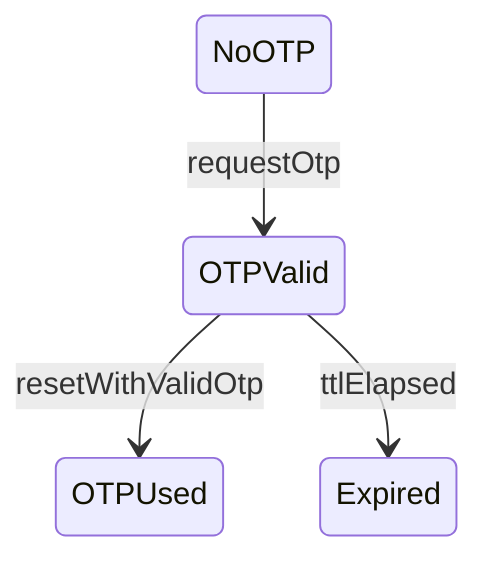

# State Transition Testing

Create only a **proposed** FSM, State Table, and test cases for user confirmation. Do not call an API, manipulate real time or data, or advance the pipeline automatically. Do not generate tests for GET endpoints.

## 1. Expected input

- States, initial/final states, and events.
- Related endpoint/event and response/side effect rules from `README.md` and `api_specification.md`.
- For FR-03, use this proposed starting model: `NoOTP → OTPValid → OTPUsed/Expired`.
- OTP rules: six digits, bound to the requesting email, time-limited, and invalidated after use.
- A concrete TTL, status code, or response schema if the project specifies one; otherwise mark it as unspecified.

## 2. Step-by-step process

1. **Draw the proposed FSM.** List states, events, guards, actions, and next states before drawing Mermaid. Clearly distinguish specification requirements from tester-proposed states/events. At minimum, represent `NoOTP`, `OTPValid`, `OTPUsed`, and `Expired`; `POST /api/forgot-password` issues an OTP, while `POST /api/reset-password` consumes a valid OTP.
2. **Derive 0-switch coverage.** Create paths/tests so every single valid transition is traversed at least once. Each case must state how to establish the initial state, the event, expected next state, and observable response/side effect. Cover an OTP with the correct email, wrong email, wrong token, expired token, and reused token.
3. **Create the complete State Table.** Take the Cartesian product of **every state × every event**, including invalid transitions. For every cell, record valid/invalid, guard, expected state, and expected rejection/side effect. Do not list only the happy path; transitions that attempt another reset from `OTPUsed` or `Expired` must be examined to detect an incorrectly permitted state change.

Do not turn one generation into the entire suite of at least 35 cases. This output is the state-based portion of a multi-technique process; after generating it, stop for review and record the AI invocation through `ai-audit-logger` when that logger is operating.

## 3. Output format

### FSM definition

| State | Meaning | Initial/Final | Basis/assumption requiring confirmation |
|---|---|---|---|

### Complete State Table

| Transition ID | Current State | Event | Guard/Test data | Valid? | Expected State | Expected response/side effect | Source |
|---|---|---|---|---|---|---|---|

### 0-switch and invalid-transition test cases

| Test Case ID | Coverage type | Transition ID | Setup state | Request sequence | Expected states | Expected status/response | Requirement source |
|---|---|---|---|---|---|---|---|

End the output with: `Status: PROPOSED — the FSM and all invalid transitions are pending user confirmation.`

## 4. Short input → output example

**Input:** State=`OTPUsed`; event=`resetWithSameOtp` on `POST /api/reset-password`.

**Condensed output:**

| Transition ID | Current State | Event | Guard/Test data | Valid? | Expected State | Expected response/side effect | Source |
|---|---|---|---|---|---|---|---|
| T-USED-RESET | OTPUsed | resetWithSameOtp | Same email and previously consumed OTP | No | OTPUsed | Reject reset; password remains unchanged; status not specified | README SEC-07 |

| Test Case ID | Coverage type | Transition ID | Setup state | Request sequence | Expected states | Expected status/response | Requirement source |
|---|---|---|---|---|---|---|---|
| FR03-ST-001 | Invalid transition | T-USED-RESET | Issue and successfully consume an OTP | Submit reset again with the old OTP | OTPUsed → OTPUsed | Reject; status requires confirmation | README SEC-07 |

