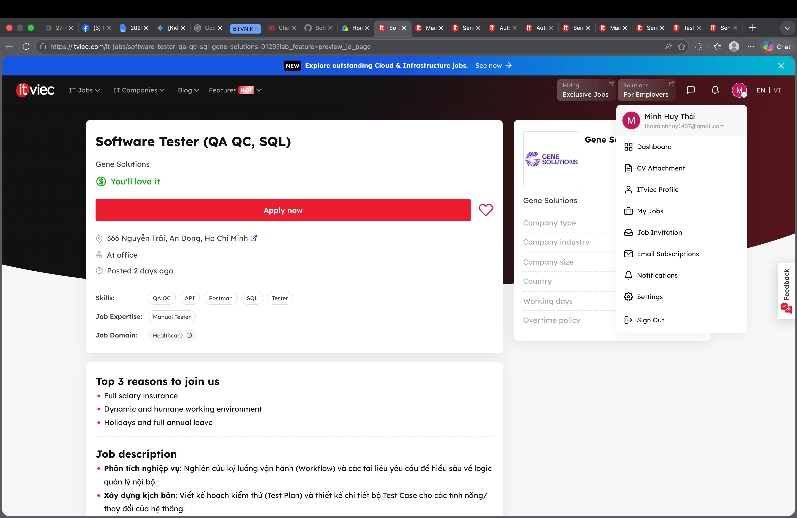
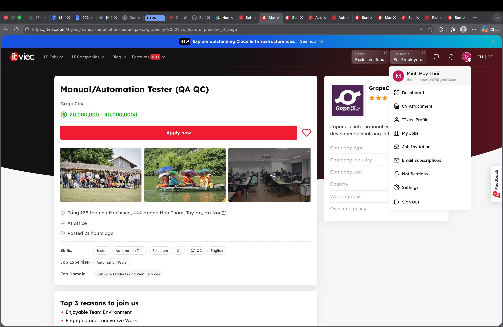
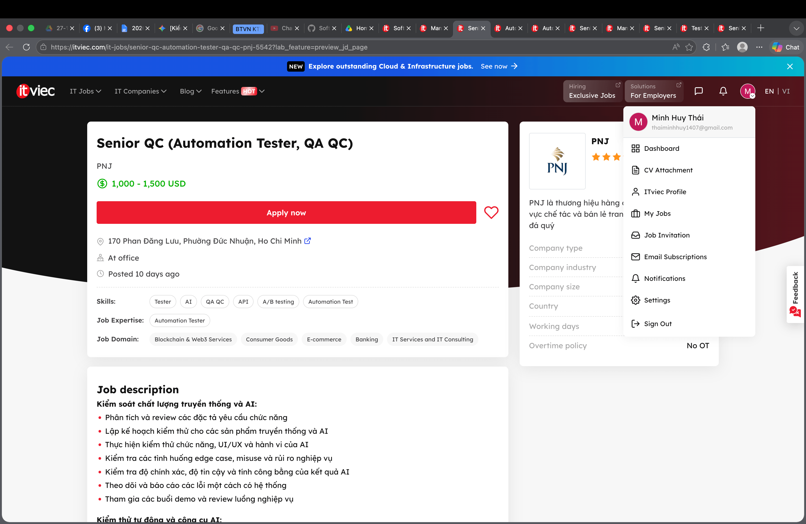
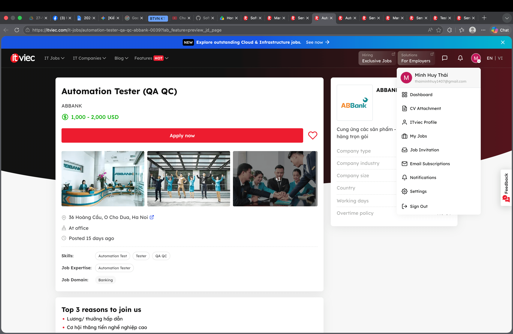
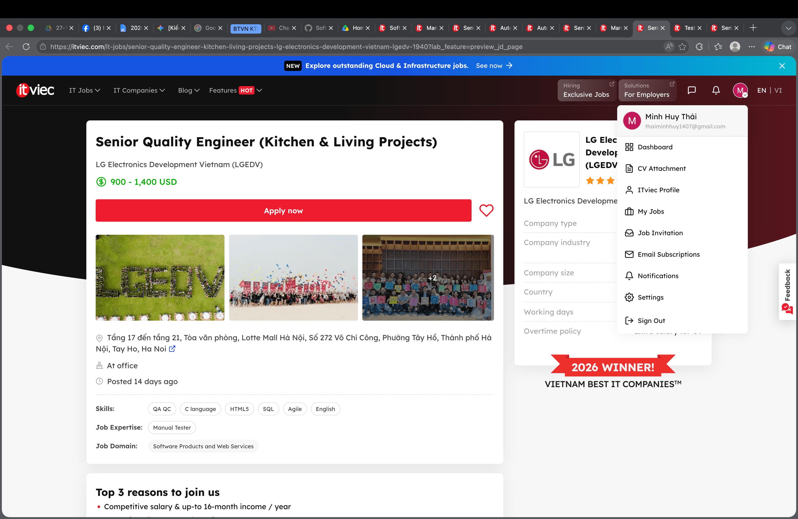
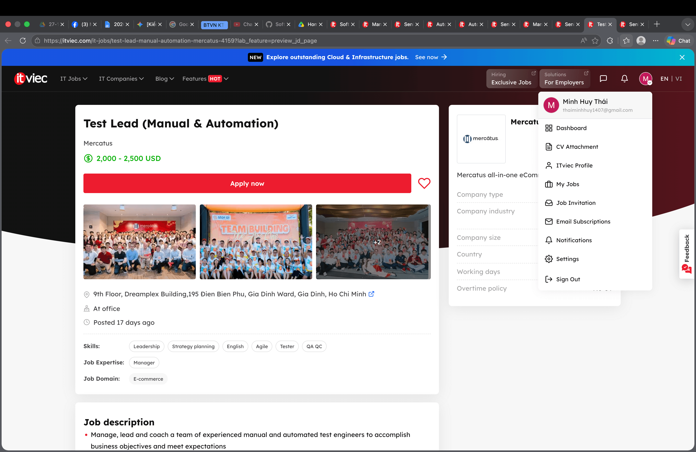
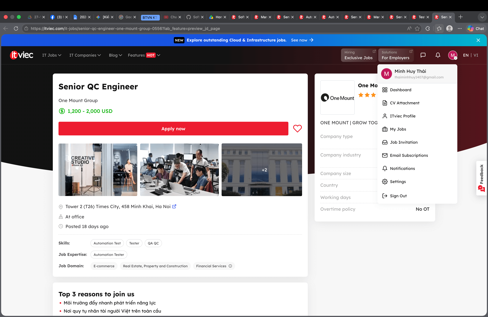

# BÀI TẬP VỀ NHÀ SỐ 1
- **Sinh viên**: Thái Minh Huy
- **MSSV**: 23127379
- **Học phần**: Kiểm Chứng Phần Mềm (Software Testing)
- **Mã môn học**: CSC15003
- **Lớp**: 23KTPM2
- **Giảng viên phụ trách**:
    + Thầy Lâm Quang Vũ
    + Thầy Trương Phước Lộc
    + Thầy Hồ Tuấn Thanh
## 1. QA/QC Job Market 2026+
```
Mục tiêu của yêu cầu này là sinh viên sẽ phải tìm hiểu là thị trường công nghệ thông tin hiện nay có những yêu cầu, mô tả về công việc như thế nào về công việc Tester/QA/QC.

Mục đích là tìm 10 công việc liên quan đến Tester, QA, QC trong đó là có ba công việc có liên quan đến việc sử dụng A.I là chủ đạo chính. Sinh viên sẽ yêu cầu tổng hợp là công việc đó có link, chụp hình, JD, kỹ năng và mức lương. Đối với JD liên quan có dùng A.I, đánh giá mức độ công việc sử dụng A.I ra sao.

Những công việc có dấu (*) là công việc có sử dụng A.I làm chủ đạo.
```

Dưới đây là danh sách thị trường việc làm có liên quan đến công việc Tester/QA/QC đang diễn ra vào năm 2026:

### 1.1: Software Tester (QA QC, SQL) - Gene Solutions
- Link: https://itviec.com/it-jobs/software-tester-qa-qc-sql-gene-solutions-0129?lab_feature=preview_jd_page

- Dated screenshot (hình ảnh minh chứng):
    

- Job Description (Mô tả công việc): 
    + Phân tích nghiệp vụ: Nghiên cứu kỹ luồng vận hành (Workflow) và các tài liệu yêu cầu để hiểu sâu về logic quản lý nội bộ.
    + Xây dựng kịch bản: Viết kế hoạch kiểm thử (Test Plan) và thiết kế chi tiết bộ Test Case cho các tính năng/ thay đổi của hệ thống.
    + Thực hiện kiểm thử: Tiến hành kiểm thử chức năng (Functional), kiểm thử phân quyền (Role-based), kiểm thử giao diện (UI/UX) và kiểm thử dữ liệu trên các trình duyệt Web phổ biến (Chrome, Edge, Firefox, Safari).
    + Quản lý lỗi: Phát hiện, phân tích nguyên nhân, phân loại mức độ nghiêm trọng và log lỗi lên hệ thống quản lý dự án nội bộ.
    + Kiểm tra dữ liệu: Thực hiện truy vấn cơ sở dữ liệu để đối chiếu và xác bóc dữ liệu hiển thị trên Web App đúng với cơ sở dữ liệu.
    + Nghiệm thu & Báo cáo: Theo dõi tiến độ sửa lỗi của Developer, thực hiện Re-test, Regression Test và viết báo cáo chất lượng trước khi bàn giao hệ thống cho các phòng ban sử dụng.
    + Hỗ Trợ user làm kiểm thử nghiệm thu (User Acceptance Test - UAT): Hỗ trợ user trong quá trình làm UAT và làm rõ các phản hồi về lỗi chuyển về cho Developer.
- Required Skill (Yêu cầu kỹ năng): 
    + Tốt nghiệp đại học chuyên ngành IT, BA hoặc các chuyên ngành liên quan.
    + Kinh nghiệm: 1-3 năm làm Manual QC.
    + Tiếng Anh: Đọc tài liệu, giao tiếp qua ứng dụng.
    + Tư duy hệ thống: Tư duy logic tốt, bao quát các kịch bản kiểm thử theo phân luồng vận hành phức tạp.
    + Có khả năng thiết kế test plan và viết testcase chi tiết, có khả năng viết câu lệnh truy vấn SQL ở mức cơ bản đến khá để kiểm tra dữ liệu (Select, Join, Insert, Update), biết sử dụng Postman để kiểm thử các luồng API cơ bản của Web App.
    + Điểm cộng: biết Automation Testing

- Salary: You'll love it (Thương lượng)

- A.I Impact Analysis: A.I có thể hỗ trợ manh mẽ trong việc tự động sinh các câu lệnh truy vấn SQL phức tạp và tạo kịch bản test API trên Postman nhằm tối ưu thời gian kiểm thử dữ liệu. Tuy nhiên, việc phân tích luồng nghiệp vụ nội bộ đặc thù và trực tiếp hỗ trợ người dùng thực tế đòi hỏi kỹ năng giao tiếp của con người.

### 1.2: Manual/Automation Tester (QA QC) - GrapeCity
- Link: https://itviec.com/it-jobs/manual-automation-tester-qa-qc-grapecity-2052?lab_feature=preview_jd_page

- Dated screenshot:
    

- Job Description: 
    + Study and analyze requirements and system specifications and technical design documents to provide timely and meaningful feedback
    + Work with internal teams (e.g developers and team leaders) to identify system requirements/the customer needs.
    + Create test design and test cases.
    + Execute various types of testing: functional, regression, integration, system, and exploratory testing across web and mobile platforms.
    + Writing automation test scripts.
    + Estimate, prioritize testing activities.
    + Perform thorough regression testing/exploratory testing when bugs are resolved.
    + Troubleshoot and report bugs and errors to development teams.

- Required Skill:
    + From 2 years of working experience in software Testing (API, Web, Mobile Testing, …) 
    + Strong experience documenting user scenarios, test case, checklist and test report
    + Cross browser, cross platform, and responsive web/mobile testing experience
    + Ability to analyze logs (browser console, network tab)
    + Analytical mind and good problem-solving skills
    + Proactive, responsible, organized, able to work independently, and gives attention to detail
    + Reading/writing in English at intermediate level. (Can use in work)
    + ISTQB Foundation certification is plus
    + Having experience with automation testing frameworks (E.g: Selenium or equivalent tools)
    + Having programming experience in any language (C# is a plus) 
    + Good critical & logical thinking

- Salary: 20.000.000 - 40.000.000đ

- A.I Impact Analysis: A.I có thể hỗ trợ mạnh mẽ trong việc thiết kế test case và có thể hỗ trợ tốt trong việc viết script automation test. Tuy nhiên trải nghiệm trong việc sử dụng đa nền tảng, đa thiết bị hay trải nghiệm người dùng thì A.I chưa thay thế được.

### 1.3: Senior QC (Automation Tester, QA QC) - PNJ (*)
- Link: https://itviec.com/it-jobs/senior-qc-automation-tester-qa-qc-pnj-5542?lab_feature=preview_jd_page

- Dated screenshot:
    

- Job Description: 
    + Kiểm soát chất lượng truyền thống và AI:
        - Phân tích và review các đặc tả yêu cầu chức năng
        - Lập kế hoạch kiểm thử cho các sản phẩm truyền thống và AI
        - Thực hiện kiểm thử chức năng, UI/UX và hành vi của AI
        - Kiểm tra các tình huống edge case, misuse và rủi ro nghiệp vụ
        - Kiểm tra độ chính xác, độ tin cậy và tính công bằng của kết quả AI
        - Theo dõi và báo cáo các lỗi một cách có hệ thống
        - Tham gia các buổi demo và review luồng nghiệp vụ 
    + Kiểm thử tự động và công cụ AI:
        - Phát triển các kịch bản kiểm thử tự động
        - Áp dụng các công cụ kiểm thử AI (LLM evaluation, synthetic data)
        - Thiết lập và duy trì hệ thống CI/CD cho kiểm thử
        - Sử dụng công cụ giả lập người dùng để kiểm thử tự động
        - Phát triển các công cụ nội bộ hỗ trợ kiểm thử AI 
    + Đảm bảo chất lượng dữ liệu cho AI:
        - Kiểm tra tính đầy đủ và chính xác của dữ liệu huấn luyện AI
        - Đánh giá tính đa dạng và cân bằng của dữ liệu
        - Kiểm tra việc xử lý dữ liệu cá nhân và tuân thủ bảo mật
        - Theo dõi hiệu suất mô hình AI theo thời gian
    + Học hỏi và phát triển:
        - Nghiên cứu các xu hướng, công cụ và phương pháp kiểm thử AI mới
        - Chủ động nâng cao tư duy kiểm thử manual + automation, tư duy phân tích rủi ro và tư duy end user
        - Tham gia các khóa học và hoạt động nâng cao kỹ năng
        - Chia sẻ kiến thức với đồng nghiệp

- Required Skill:
    + Bằng cấp: Cử Nhân trở lên các chuyên ngành CNTT & Phần mềm.
    + Chuyên ngành:  Khoa Học Máy Tính, Công Nghệ Thông Tin, hoặc các ngành có liên quan.
    + Must Have:
        - Tối thiểu 04 năm kinh nghiệm trong lĩnh vực Software Testing Automation ứng dụng AI trong testing
        - Chủ động, năng động, trách nhiệm cao, kiên định bám mục tiêu
        - Có khả năng xử lý nhiều dự án song song, biết sắp xếp ưu tiên theo tiến độ công việc
        - Có tư duy end-user, cẩn thận trong công việc
        - Giao tiếp tốt, phối hợp hiệu quả với các team liên quan.
        - Có khả năng phân tích các rủi ro hệ thống
- Salary: 1,000 - 1,500 USD

- A.I Impact Analysis: A.I sẽ hỗ trợ đắc lực trong việc tự động sinh dữ liệu giả lập và đánh giá LLM trực tiếp trên các hệ thống CI/CD nhằm tối ưu hoá luồng kiểm thử liên tục. Tuy nhiên, A.I không thể thay thế con người trong việc thẩm định tính công bằng, phát hiện thiên kiến và đánh giá các rủi ro nghiệp vụ phức tạp của chính mô hình đó.

### 1.4: Automation Tester (QA QC) - ABBANK
- Link: https://itviec.com/it-jobs/automation-tester-qa-qc-abbank-0039?lab_feature=preview_jd_page

- Dated screenshot:
    

- Job Description:
    - Xây dựng dụng cụ cho automation test và viết script cho các api/rest và application test.
    - Định nghĩa, phát triển, triển khai và duy trì script cho automation test
    - Quản lý phiên bản (source control) cho automation test script
    - Tham gia các cuộc họp về yêu cầu dự án để hiểu mục đích của dự án. Đóng góp thông tin về tính khả thi của dự án trên phương diện testing. Ước lượng thời gian testing cho dự án
    - Đưa ra phương án testing, phát triển các chiến lược automation test và các framework cho automation test…
    - Thiết kế test case và viết automation scripts.
    - Phối hợp với các thành viên khác trong nhóm để hiểu về mục tiêu của dự án, thu thập các yêu cầu liên quan đến automation, thiết kế automated test và giải quyết các vấn đề liên quan đến testing.
    - Phối hợp với nhóm Manual testing để đảm bảo phạm vi kiểm tra toàn diện.
    - Tham gia thực hiện Manual test khi cần thiết.
    - Luôn cập nhật các xu hướng và tiến bộ của ngành về các công cụ và kỹ thuật về automation testing.

- Required Skill:
    - Trình độ Cử nhân trở lên chuyên ngành về Công nghệ thông tin, Khoa học máy tính hoặc các chuyên ngành liên quan.
    - Có trên 02 năm kinh nghiệm trong automation testing cho api/rest hoặc mobile hoặc web
    - Ưu tiên ứng viên có kinh nghiệm làm việc với Agile/Scrum
    - Thông thạo trong việc viết automation test script với các ngôn ngữ như Java, C#.net, Python, Javascript, etc..
    - Am hiểu về các giai đoạn trong việc kiểm thử phần mềm như: kiểm thử tính năng, kiểm thử tích hợp, kiểm thử tự động, kiểm thử white-box/black box, và kiểm thử load/performance;
    - Kinh nghiệm sử dụng các bộ công cụ, framework như Katalon, Postman, Rest Assured, SoapUI, Selenium Webdriver, Mobile automation test, Jmeter, Jenkins, etc là một lợi thế;
    - Kinh nghiệm quản lý phiên bản (version control) (như Git) và CI/CD
    - Đào tạo, mentoring/ coaching các nhân viên trong team và dự án về các quy trình test driven development, automation testing liên quan đến SIT, UAT, Compliance Test, Performance test etc.
    - Cẩn thận, tỉ mỉ, cần cù, nhanh nhẹn, có khả năng làm việc độc lập hoặc nhóm với cường độ cao.
    - Tinh thần không ngại thay đổi tool/ framework/ ngôn ngữ

- Salary: 1,000 - 2,000 USD

- A.I Impact Analysis: A.I có thể thay thế một phần công việc sinh ra script để thực hiện test plan, thiết kế script automated test. Tuy nhiên, A.I sẽ không thể thay thế con người ở quy trình làm việc nội bộ, phối hợp với các bên khác để thực hiện.


### 1.5: Automation QA Engineer (QA QC/Tester/Automation Test) - Nakivo (*)
- Link: https://itviec.com/it-jobs/automation-qa-engineer-qa-qc-tester-automation-test-nakivo-0115?lab_feature=preview_jd_page

- Dated screenshot: 
    

- Job Description:
    + Collaborate with software developers and quality assurance teams to understand project requirements and functionality
    + Design, develop, and execute automated test scripts using industry-standard automation tools
    + Identify and report software defects in a clear and concise manner
    + Work closely with cross-functional teams to analyze test results and troubleshoot issues
    + Contribute to the continuous improvement of the automation testing process
    + Design, create, and manage automation test cases using AI technologies
- Required Skill:
    + You properly are a potential candidate for this position, if you have:
        - Bachelor degree in Computer Science, Engineering, or related field
        - Strong understanding of software development life cycle and testing methodologies
        - 3 years of experience or more in relevant positions
        - Proficient in at least one programming language (e.g., Java, Python, C#)
        - Familiarity with automation testing tools such as Selenium, Appium, or similar
        - Basic knowledge of version control systems (e.g., Git)
        - Excellent problem-solving and analytical skills
        - Strong communication and collaboration skills
        - Experience with AI-automation testing (e.g., Copilot, Cursor, Perplexity)
    + You will be a strong candidate if you have:
        - Experience in working with test automation frameworks (e.g. JUnit, TestNG, Selenium WebDriver)
        - Understanding of web technologies (HTML, CSS, JavaScript)
        - Knowledge of API testing and tools (e.g., Postman, RestAssured)
        - Experience with performance testing concepts and tools
        - Experience with VMware, Hyper-V, Aws and Cloud storage
        - Hands-on experience working with AI technologies
- Salary: 1,100 - 1,500 USD

- A.I Impact Analysis: A.I sẽ hỗ trợ trong việc thiết kế và tạo ra test plan, sinh ra những test cases tự động cho sản phẩm. Tuy nhiên, A.I sẽ chưa thay thế con người ở vai trò là hợp tác với nhiều đội khác nhau trong việc phân tích và đánh giá vấn đề.

### 1.6: Senior QA Engineer (Tester/Business Analyst) - soxes AG (*)
- Link: https://itviec.com/it-jobs/senior-qa-engineer-tester-business-analyst-soxes-ag-3239?lab_feature=preview_jd_page

- Dated screenshot: 
    

- Job Description:
    + Job Overview:
        - We are seeking an experienced and detail-oriented Senior Testing Engineer to ensure the quality, stability, and performance of our software products.
        - The ideal candidate should have strong expertise in manual testing and requirement analysis, along with basic hands-on experience using AI-assisted tools to improve testing efficiency and software quality processes.
    + Key Responsibilities & Technical Responsibilities
        - Analyze business and system requirements to ensure completeness and testability.
        - Collaborate with Product Owners, Business Analysts, and Developers to clarify requirements and expected behaviors.
        - Design, develop, execute, and maintain test plans, test cases, and testing documentation.
        - Perform functional, regression, integration, system, API, and performance testing.
        - Identify, document, track, and verify software defects.
        - Ensure software quality, reliability, scalability, and security standards are met.
        - Participate in release validation and production verification activities.
        - Utilize AI-assisted tools to improve QA productivity and testing efficiency.
        - Apply AI tools for:
            + Test case generation
            + Defect analysis
            + Test data preparation
            + Documentation support
        - Work with AI-assisted tools such as:
            + ChatGPT
            + GitHub Copilot
            + AI-based testing support tools
        - Provide recommendations for continuous improvement in QA processes and product quality.

- Required Skill:
    + Experience & Skills
        - Minimum 5+ years of experience in software testing and quality assurance.
        - Strong experience in manual testing and requirement analysis.
        - Basic knowledge or experience with automation testing is a plus.
        - Experience using AI-assisted tools in software testing or daily work activities is preferred.
    + Familiarity with:
        - RESTful APIs
        - CI/CD pipelines
        - Git version control
        - Cloud platforms
    + Education: Bachelor’s degree in Computer Science, Information Technology, or a related technical field.
    + Language Skills: Strong English communication skills, with the ability to work effectively in an international environment and collaborate directly with overseas partners.

- Salary: 1,800 - 2,200 USD

- A.I Impact Analysis: A.I hỗ trợ trong việc sinh test case, phân tích vấn đề, mock data, hỗ trợ trong việc viết báo cáo, tối ưu hoá quy trình và hiệu quả trong quy trình phát triển phần mềm. Tuy nhiên, việc liên hệ, giao tiếp, hợp tác với các đội với nhau thì A.I vẫn chưa thể thay thế được.


### 1.7: Manual Tester (Fresher/Junior) - MediaX (*)
- Link: https://itviec.com/it-jobs/manual-tester-fresher-junior-mediax-3442?lab_feature=preview_jd_page

- Dated screenshot:
    

- Job Description: MediaX đang tìm Manual Tester có tư duy logic, cẩn thận, chủ động và quan tâm đến chất lượng sản phẩm. Bạn tham gia kiểm thử các sản phẩm thực tế như:
    - AI Assistant, AI Agent
    - CMS, Admin System
    - Website, Web App, Mobile App
    - Workflow Automation System
    - Data Management System
    - Internal Tools và AI Product

    Vị trí phù hợp với bạn nếu bạn thích:
    - Kiểm thử theo flow người dùng thực tế
    - Phát hiện bug, edge case, lỗi UI/UX
    - Làm việc sát với Dev, PM, BA
    - Chủ động góp ý để cải thiện sản phẩm
    - Làm việc trong môi trường Agile/Scrum linh hoạt

    Mô tả công việc:
    -  Đọc hiểu requirement, business flow và luồng nghiệp vụ của hệ thống
    - Tham gia review requirement cùng team để phát hiện rủi ro từ sớm
    - Thiết kế checklist, test case, test scenario
    - Thực hiện manual testing cho các tính năng trên Website, App, CMS, Admin System và AI Product
    - Kiểm thử functional flow, UI/UX, permission, role, data validation, upload, import, export
    - Kiểm thử responsive, cross-browser, user flow và dashboard flow
    - Kiểm thử AI Chat, AI Agent flow theo kịch bản người dùng
    - Thực hiện smoke testing, regression testing, UI testing, functional testing
    - Log bug rõ ràng, đủ thông tin, giúp Dev dễ reproduce và fix
    - Theo dõi, retest và verify bug sau khi Dev xử lý
    - Kiểm tra chất lượng sản phẩm trước khi release
    - Chủ động phát hiện vấn đề ảnh hưởng đến trải nghiệm người dùng
    - Phối hợp với Dev, PM để đảm bảo tiến độ và chất lượng dự án
    - Báo cáo tiến độ testing, tình trạng bug và rủi ro phát sinh
- Required Skill:
    + Must have:
        - Có kinh nghiệm Manual Tester, QA hoặc QC từ 6 tháng trở lên
        - Hiểu cơ bản về quy trình phát triển phần mềm
        - Có tư duy logic, kỹ năng phân tích và xử lý vấn đề
        - Có kinh nghiệm viết test case, checklist, log bug
        - Có kinh nghiệm regression testing và UI testing
        - Đọc hiểu requirement và mô tả nghiệp vụ tốt
        - Cẩn thận, có trách nhiệm, chú ý đến chi tiết
        - Biết sử dụng Jira, Trello hoặc Notion
        - Biết sử dụng Google Sheet, Google Docs
        - Biết dùng DevTools ở mức cơ bản
    + Nice to have:
        - Có kinh nghiệm test CMS hoặc hệ thống quản trị
        - Có kinh nghiệm test AI Chat, AI Agent
        - Có kinh nghiệm test hệ thống phân quyền nhiều role
        - Có tư duy UI/UX
        - Biết dùng Postman cơ bản
        - Đọc hiểu tài liệu tiếng Anh tốt
        - Có chứng chỉ ISTQB là lợi thế
- Salary: 7.000.000 - 15.000.000 triệu

- A.I Impact Analysis: A.I có thể thay thế và hỗ trợ trong quá trình thu thập yêu cầu, thiết kế checklist, testcase, kịch bản test phù hợp. Tuy nhiên, A.I sẽ chưa thay thế con người ở phần giao diện và thiết kế hướng về người dùng.

### 1.8: Senior Quality Engineer (Kitchen & Living Projects) - LG Electronics Development Vietnam (LGEDV)
- Link: https://itviec.com/it-jobs/senior-quality-engineer-kitchen-living-projects-lg-electronics-development-vietnam-lgedv-1940?lab_feature=preview_jd_page

- Dated screenshot: 
    

- Job Description:
    - Analyze software project requirements (embedded software focus) and design/update Test Cases.
    - Prepare and manage test environments according to project needs.
    - Perform manual, exploratory, ad-hoc, and TC-based testing to ensure software quality.
    - Log, verify, and manage defects on tracking systems and escalate risks to leaders.
    - Ready for on-site work in Korea if requested by the project.

- Required Skill:
    + Bachelor’s degree in IT, Computer Science, Electronics, Telecommunications, or equivalent.
    + At least 5 years of experience in software testing.
    + ISTQB Certified Tester Foundation Level (CTFL) is required.
    + Good English communication
    + Strong understanding of SDLC, Test processes, and Test Techniques.

- Salary: 900 - 1,400 USD

- A.I Impact Analysis: A.I có thể hỗ trợ trong quá trình thiết kế test plan, test case trong quá trình làm sản phẩm. Tuy nhiên, việc quản lý lỗi và issues của sản phẩm thì cần kinh nghiệm và hiểu biết của kỹ sư để có thể tra cứu, xác nhận những vấn đề trên cho các lãnh đạo.

### 1.9: Test Lead (Manual & Automation) - Mercatus
- Link: https://itviec.com/it-jobs/test-lead-manual-automation-mercatus-4159?lab_feature=preview_jd_page

- Dated screenshot:
    

- Job Description:
    + Manage, lead and coach a team of experienced manual and automated test engineers to accomplish business objectives and meet expectations
    + Attract, hire and retain key talent. Employ best leadership skills and practices to build and motivate the team.
    + Lead onboarding effort for new team members.
    + Engage in meaning full 1:1s with your team members, covering a range of topics: job fulfillment, career ambitions and subsequent planning and ongoing issues
    + Contribute to the software delivery process, from exploratory testing to developing acceptance criteria, to bug advocacy, to verification-based testing.
    + Coordinate with the product, engineering, and design manager son the team to meet key objectives and advocate for quality
    + Employ Total Quality Management strategies by implementing continuous and systematic improvement, integration and streamlining of meetings
    + Help shape company-wide processes and work with other Engineering Managers to continually evaluate how we can better support our reports and each other
    + Design, architect, and execute initiatives to improve Quality Assurance process and increase product
    + Evaluate, recommend, build and maintain an ecosystem of tools, frameworks and libraries
    + Lead the development of automation initiatives using Python for APIs, web port

- Required Skill:
    + Have minimum 5+ years of experience in lead team in software testing
    + Have experience in Manual and automated testing tools/frameworks (Postman, Cypress, Selenium,...)
    + Have experience languages such as C, C++, C#, Java, Java Script, Python
    + Good understanding on testing process, testing lifecycle
    + Good English
    + Having working experience in e-commerce domain knowledge is a plus
    + Working experience in remote distributed team.
    + Familiarity with Agile/Scrum model
    + Familiarity with collaboration tools such as JIRA, Confluence

- Salary: 2,000 - 2,500 USD

- A.I Impact Analysis: A.I có thể hỗ trợ trong việc đóng góp vào quá trình dự án phần mềm để phù hợp với yêu cầu khách hàng. Tuy nhiên, việc quản lý nhân sự và kinh nghiệm trong lĩnh vực Thương mại điện tử thì A.I vẫn chưa thể thay thế được và cần có con người trong quá trình lãnh đạo và hiểu biết bản thân đối với lĩnh vực liên quan.

### 1.10: Senior QC Engineer - One Mount Group
- Link: https://itviec.com/it-jobs/senior-qc-engineer-one-mount-group-0556?lab_feature=preview_jd_page

- Dated screenshot: 
    

- Job Description:
    + Analyze business and system requirements to define appropriate test strategies and plans.
    + Design and execute test cases for web, mobile, UI, API, and performance testing.
    + Develop, maintain, and enhance automation test scripts and frameworks.
    + Validate system quality, integrated features, and data accuracy.
    + Log, track, and manage defects using JIRA or equivalent tools.
    + Collaborate with Developers, Product Owners, Business Analysts, and DevOps to ensure product quality throughout the SDLC.
    + Integrate automated testing into CI/CD pipelines and support continuous testing practices.
    + Use AI tools to improve testing productivity, including generating test ideas, test cases, scripts, and test data.
    + Report progress, risks, and blockers proactively, and support junior team members when needed.
- Required Skill:
    + Required Experience and Skills
        - 4+ years of experience in software testing and quality assurance.
        - Strong experience in test planning, test case design, execution, and reporting.
        - Hands-on experience in automation testing with frameworks such as Robot Framework, Selenium, Playwright, Cypress, or Appium.
        - Proficient in at least one programming/scripting language such as Python, Java, JavaScript, or C#.
        - Experience in API testing using Postman, SoapUI, Swagger, or similar tools.
        - Good SQL skills for data validation and backend testing.
        - Familiarity with Git and collaborative development workflows.
        - Practical experience with CI/CD tools such as Jenkins, GitLab CI/CD, GitHub Actions, or Azure DevOps.
        - Experience using AI tools such as ChatGPT, GitHub Copilot, or similar tools to support testing activities.
        - Solid understanding of functional, regression, integration, system, UAT, performance, and automation testing.
        - Strong problem-solving, communication, and teamwork skills.
        - Ability to work independently and manage multiple tasks in a fast-paced environment.
    + Preferred Qualifications
        - Bachelor’s degree in IT, Computer Science, Software Engineering, or a related field.
        - Experience working in an Agile/Scrum environment.
        - Experience in Banking, Finance, or Fintech projects is a plus.
        - Familiarity with performance testing tools such as JMeter or K6 is an advantage.
        - Knowledge of security testing, test data management, and risk-based testing is a plus.

- Salary: 1,200 - 2,000 USD

- A.I Impact Analysis: A.I có thể hỗ trợ trong quá trình triển khai test plan, test case, có thể hỗ trợ trong quá trình viết script CI/CD. Tuy nhiên, A.I vẫn chưa thể thay thế con người trong kiến thức chuyên môn liên quan đến ngân hàng, tài chính và vấn đề liên quan đến Fintech

## 2. Software Defects 2022-2026
```
Mục tiêu của yêu cầu này giúp cho sinh viên hiểu được tầm quan trọng của việc kiểm thử như thế nào ở trong doanh nghiệp công nghệ thông tin khi mà làm ra một sản phẩm phần mềm như thế nào. 

Đặc biệt là trong năm 2026, các mô hình ngôn ngữ lớn, A.I Agent ngày càng ứng dụng ở mọi nơi thì tầm quan trọng của việc kiểm thử nội dung của A.I tạo ra là vô cùng quan trọng để bảo vệ tài sản, tiền bạc của doanh nghiệp, cần có những quyết định đúng trước những dữ liệu mà A.I sinh ra.

Yêu cầu bài tập này, tìm ra 20 lỗi phần mềm được tìm thấy vào năm 2022 đến 2026, trong đó cần tìm ít nhất 5 lỗi có liên quan đến A.I như (ảo giác - hallucination, tiêm Prompt - prompt injection, thiên kiến - bias). Mỗi defect cho biết: link, mô tả, đô nghiêm trọng, hậu quả, cách giải quyết.

Những bài post có gắn dấu (*) là những bài post có lỗi phần mềm liên quan đến A.I
```
Dưới đây là danh sách các lỗi phần mềm (Software Defects) đã được tìm thấy và công bố vào năm 2022-2026

### 2.1. compliance-trestle Remote Fetching Mechanism has an Arbitrary File Write via Cache Path Traversal
- Source link: https://github.com/advisories/GHSA-g3vg-vx23-3858

- Description: Cơ chế lưu bộ nhớ đệm từ xa (remote fetching cache mechanism) của thư viện qua HTTPSFetcher và SFTPFetcher đã tự động xây dựng đường dẫn file cache cục bộ trực tiếp từ URL mà không thông qua bộ lọc làm sạch chuỗi ký tự di chuyển thư mục (../). Khi một hồ sơ OSCAL từ xa cấu hình đường dẫn chứa chuỗi ký tự này, nội dung phản hồi HTTP độc hại sẽ ghi đè vào một vị trí bất kỳ nằm ngoài thư mục cache dự kiến trên hệ thống tệp tin.

- Severity: High - 7.1/10

- Consequences: Hành vi ghi file tuỳ ý cho phép kẻ tấn công có thể điều khiển từ xa, tiêm mã độc vào Cron Job, SSH key dẫn đến ghi đè vào file cấu hình và dẫn đến chiếm toàn bộ quyền điều khiển thư viện Python.

- Solution: sử dụng phiên bản 4.0.3 và 3.12.2 của gói compliance-trestle để khắc phục vấn đề trên. Đồng thời, nhà phát triển đã bóc tách và xử lý hai ký tự đặc biệt là ".." và "/" ra khỏi đường dẫn, thêm phương thức "is_relative_to" để đảm bảo là đường dẫn vẫn nằm trong cache directory.

### 2.2. FUXA's Unauthenticated Project Data Disclosure Exposes Server-Side Scripts and Device Configurations
- Source link: https://github.com/advisories/GHSA-q3w6-q3hc-c5x6

- Description: đường dẫn Endpoint GET /api/project để lộ dữ liệu cấu hình to yêu cầu của khách hàng kể cả khi middleware secureEnabled đã được kích hoạt. Middle secureFunc có dùng middleware VerifyToken, nếu token không hợp lệ thì tự động cấp một token hợp lệ

- Severity: High - 7.5/10

- Consequences: Bất kỳ ai cũng có thể gọi đến API này mà không cần token xác thực dẫn đến mã nguồn ở phía bên Server có thể bị lộ logic và thông tin nhạy cảm, thông tin thiết bị kết nối. Trong môi trường doanh nghiệp lớn, thông tin này khi bị lộ sẽ là con đường đi sâu vào lõi bên trong hệ thống.

- Solution: đề xuất nâng cấp gói fuxa-server từ phiên bản 1.3.0 lên phiên bản 1.3.1

### 2.3. Yamcs Vulnerable to Authenticated Remote Code Execution (RCE) via Jython Algorithm Code Injection
- Source link: https://github.com/advisories/GHSA-2g95-6x5q-xjwj

- Description: lỗ hổng bảo mật được tìm thấy ở bên mã nguồn Server-Side tồn tại trong script Yamcs khởi chạy cho thuật toán Python. Ứng dụng này biên dịch và đánh giá động văn bản thuật toán do người dùng kiểm soát bằng Jython mà không thực thi môi trường Sandbox an toàn. Người dùng với quyền ChangeMissionDatabase có thể ghi đè logic thuật toán thông qua RestAPI, chiếm quyền điều khiển từ xa trên hệ điều hành máy chủ.

- Severity: Critical - 9.1/10

- Consequences: Lỗi này ảnh hưởng đến bất kỳ triển khai liên quan đến Yamcs khi mà người dùng có quyền ChangeMissionDatabase và có một công cụ kịch bản như Jython tồn tại trên đường dẫn. Kẻ tấn công có thể lợi dụng điều này để cấu hình cấp ứng dụng lên quyền kiểm soát hệ thống hoàn toàn, thực thi lệnh, đánh cấp dữ liệu trong cơ sở hạ tầng.

- Solution: đề xuất cập nhật gói Maven lên phiên bản 5.12.7

### 2.4. Incident 1263: Chinese State-Linked Operator (GTG-1002) Reportedly Uses Claude Code for Autonomous Cyber Espionage (*)
- Source link: https://incidentdatabase.ai/cite/1263/ và https://www-cdn.anthropic.com/d7dd50dd1185f59be051b307150d877f2b82bd2c.pdf

- Description: một nhóm tin tặc có số hiệu là GTG-1002 đã thao túng công cụ Claude Code của Anthropic và sử dụng công cụ trên nhằm tự động hoá 80-90% quy trình xâm nhập chuỗi đa giai đoạn bao gồm thực hiện trinh sát, phát hiện lổ hổng, khai thác, thu thập thông tin đăng nhập và trích xuất dữ liệu trên khoảng 30 mục tiêu

- Severity: Critical

- Consequences: Xâm nhập thành công vào 30 tổ chức lớn nhỏ, bao gồm cả tổ chức phi chính phủ nhầm lấy được nhiều tài liệu thông tin quan trọng của các tổ chức

- Solution: Anthropic đã lập tức khoá các tài khoản liên quan và cài đặt thêm nhiều cơ chế bảo mật tăng cường trong không gian mạng, thử nghiệm nhằm phát hiện các cuộc tấn công mạng tự động đã xảy ra và phát triển các kỹ thuật mới nhằm điều tra và giảm thiểu các tấn công mạng quy mô lớn.

### 2.5. FUXA Vulnerable to Unauthenticated Remote Code Execution via Script Test Mode Authorization Bypass
- Source link: https://github.com/advisories/GHSA-rg3m-cfq7-g6h6

- Description: Lỗ hổng thực thi mã từ xa không cần xác thực tồn tại trong FUXA khi secureEnabled được đặt thành true. Điểm cuối POST /api/runscript kiểm tra quyền truy cập dựa trên quyền hạn của tập lệnh được lưu trữ theo ID, nhưng khi test: true được đặt trong yêu cầu, nó sẽ biên dịch và thực thi mã do kẻ tấn công cung cấp thay vì mã của tập lệnh được lưu trữ. Kẻ tấn công không cần xác thực, nếu biết ID và tên tập lệnh hợp lệ, có thể thực thi mã tùy ý thông qua chế độ kiểm thử nếu ít nhất một tập lệnh phía máy chủ tồn tại và có thể truy cập được mà không bị hạn chế quyền.

- Severity: High - 8.9/10

- Consequences: Bất kỳ kẻ tấn công nào có thể truy cập qua mạng đều có thể thực hiện thực thi mã từ xa trên máy chủ FUXA mà không cần bất kỳ thông tin đăng nhập nào. Kẻ tấn công cần một ID và tên tập lệnh hợp lệ (có thể lấy được thông qua thông tin tiết lộ được báo cáo riêng) và một tập lệnh phía máy chủ tồn tại trong dự án. Tác động tiềm tàng bao gồm thực thi lệnh tùy ý trên máy chủ, truy cập vào các kết nối thiết bị và thông tin đăng nhập đã được cấu hình, và xâm phạm chức năng điều khiển do FUXA quản lý.

- Solution: Cập nhật gói fuxa-server từ phiên bản 1.3.0 lên phiên bản 1.3.1

### 2.6. GreyVibe hackers use ChatGPT, Gemini to power cyberattacks (*)
- Source link: https://www.bleepingcomputer.com/news/security/greyvibe-hackers-use-chatgpt-gemini-to-power-cyberattacks/

- Description: Một nhóm tội phạm mạng có khả năng đến từ Nga, được theo dõi với tên gọi GreyVibe, đã sử dụng ChatGPT và Google Gemini và một bộ công cụ phần mềm độc hại tùy chỉnh phong phú để nhắm mục tiêu vào các mục tiêu trong lĩnh vực quân sự, chính phủ, dân sự và kinh doanh.

- Severity: High

- Consequences: tấn công vào các lĩnh vực quân sự, chính phủ và dân sự, doanh nghiệp liên quan đến Ukraine. Người bị tấn công có thể bị lấy cắp thông tin liên lạc, lịch sử thông tin, thông tin thiết bị và kết nối, dữ liệu cá nhân và thông tin SIM số đang sử dụng

- Solution: về phía nhà cung cấp dịch vụ A.I, cần có những biện pháp tăng cường nhằm bảo vệ hệ thống của họ không bị lách qua những lổ hổng bảo mật. Về phía bên phòng thủ, củng cố lớp phòng thủ nhận biết trước các cuộc tấn công mạng do WithSecure cung cấp

### 2.7. SQL injection in Content API
- Source link: https://github.com/TryGhost/Ghost/security/advisories/GHSA-w52v-v783-gw97 và https://thehackernews.com/2026/05/ghost-cms-cve-2026-26980-exploited-to.html

- Description: lỗ hổng tấn công SQL Injection tồn tại trong API nội dung của Ghost cho phép kẻ tấn công không cần xác thực có thể đọc dữ liệu từ cơ sở dữ liệu

- Severity: Critical - 9.4/10

- Consequences: Lỗ hổng này cho phép kẻ tấn công truy cập vào khóa API quản trị của trang web mà không cần sự cho phép, từ đó có khả năng làm suy yếu trang web bằng cách chèn mã độc. Khóa API quản trị có thể được sử dụng để gọi API quản trị và trực tiếp chỉnh sửa các bài viết được đăng tải trên hệ thống quản lý nội dung.

- Solution: đề xuất cập nhật gói Ghost của npm lên phiên bản 6.19.1

### 2.8. Incident 693: Google AI Reportedly Delivering Confidently Incorrect and Harmful Information (*)
- Source link: https://incidentdatabase.ai/cite/693/

- Description: công cụ tìm kiếm AI của Google đã cung cấp cho người dùng những thông tin sai lệch và gây hại. Các báo cáo chỉ ra nhiều thông tin không chính xác, bao gồm cả lời khuyên sức khỏe sai lệch và những gợi ý nấu ăn nguy hiểm. Ví dụ, nó đã đưa ra thông tin sai sự thật rằng Barack Obama là tổng thống Mỹ theo đạo Hồi đầu tiên, phản ánh những thuyết âm mưu cực đoan, hoặc gợi ý rằng keo dán có thể là một nguyên liệu trong bánh pizza.

- Severity: High 

- Consequences: gây làn sóng phẫn nộ đến cho người dùng, có thể gây mất vị thế trong thị trường A.I, sự cố cung cấp thông tin không chính xác này buộc Google phải tạm thời hạn chế và thu hồi tính năng A.I Search để khắc phục sự cố

- Solution: đối với phía nhà phát triển Google, cần thắt chặt thông tin chính xác từ các thông tin uy tín, cải thiện nghiêm ngặt hơn ở cơ chế RAG, có bộ lọc nhằm phát hiện ra thông tin có thể dẫn đến chết người hoặc sai sự thật. Đối với phía người dùng, cần tỉnh táo trước những thông tin mà A.I tạo ra

### 2.9. Incident 1072: Grok Chatbot Reportedly Inserted Content About South Africa and 'White Genocide' in Unrelated User Queries (*)
- Source link: https://incidentdatabase.ai/cite/1072/

- Description: Theo các nguồn tin, chatbot Grok của xAI đã tự ý chèn những lời lẽ đề cập đến "nạn diệt chủng người da trắng" ở Nam Phi vào nhiều cuộc hội thoại không liên quan trên X. Những lời lẽ xen vào này đã đưa nội dung kích động, mang tính phân biệt chủng tộc vào các cuộc thảo luận vốn dĩ trung lập.

- Severity: High

- Consequences: sự việc này gây ô nhiễm đến việc ô nhiễm không gian thảo luận ở trên không gian mạng, quấy rối người dùng bằng các thông tin chính trị độc hại. Ngoài ra thì sự việc này có thể ảnh hưởng nghiêm trọng đến đến uy tín của X (twitter ngày nay)

- Solution: Gỡ bỏ những đoạn prompt lỗi, cần có những xác thực quyền chặt chẽ hơn nhằm hạn chế tối đa các lỗi phát sinh liên quan đến huấn luyện A.I, giúp cho A.I không sinh ra những nội dung liên quan đến chính trị, giật gân, tập trung vào đúng ngữ cảnh của người dùng


### 2.10. Incident 420: Users Bypassed ChatGPT's Content Filters with Ease (*)
- Source link: https://incidentdatabase.ai/cite/420/

- Description: Người dùng cho biết họ có thể dễ dàng vượt qua các bộ lọc nội dung và từ khóa của ChatGPT bằng nhiều phương pháp khác nhau, chẳng hạn như chèn lời nhắc hoặc tạo ra các nhân vật giả mạo để tạo ra các liên kết thiên vị hoặc tạo ra nội dung độc hại.

- Severity: High

- Consequences: hậu quả của vấn đề trên có thể dẫn đến thông tin sai lệch, kẻ tấn công có thể lợi dụng được sơ hở bảo mật kém nhằm tạo ra những prompt nhằm lách qua bộ bảo vệ dữ liệu, đầu ra của mô hình ngôn ngữ lớn để có thể sinh ra những nội dung không hợp lệ, có thể gây hại đến người dùng

- Solution: đối với các nhà phát triển nội dung, cần cải thiện bộ lọc đầu ra của mô hình ngôn ngữ lớn, thiết lập nhiều cơ chế bảo vệ để nhằm ngăn ngừa prompt injection

### 2.11. Incident 541: ChatGPT Reportedly Produced False Court Case Law Presented by Legal Counsel in Court (*)
- Source link: https://incidentdatabase.ai/cite/541/

- Description: Trong vụ kiện Mata kiện Avianca, Inc., một luật sư đã sử dụng ChatGPT để nghiên cứu. ChatGPT đã tạo ra các vụ kiện ảo, sau đó luật sư này đã trình bày chúng trước tòa. Tòa án đã phán quyết rằng các vụ kiện đó không tồn tại.

- Severity: High

- Consequences: A.I đã sinh ra một thông tin hoàn toàn giả, không có bất kỳ xác nhận thực tế là đây có phải là một chuyên án có thật trong thực tế không

- Solution: đối với phía nhà phát triển, cần có nhiều bộ lọc thông tin đáng tin cậy để cho A.I có thể được học vào, cần tránh những thông tin rải rác có thể dẫn đến sinh ra dữ liệu giả. Đối với phía người dùng, cần có xác thực, tìm hiểu những dữ liệu mà A.I sinh ra có thật sự chính xác và đúng sai bao nhiêu

### 2.12. HAXcms createSite SSRF Enables Arbitrary File Read
- Source link: https://github.com/advisories/GHSA-q862-gcgq-5m6g

- Description: Lỗ hổng Server-Side Request Forgery (SSRF) đã được xác thực trong HAXcms cho phép kẻ tấn công truy xuất các tài nguyên nội bộ hoặc cục bộ tùy ý và ghi phản hồi vào một thư mục có thể truy cập qua web, cho phép đọc tệp tùy ý và truy cập mạng nội bộ.

- Severity: High - 7.1/10

- Consequences: 
    + Lỗ hổng SSRF cho phép truy cập vào các dịch vụ mạng nội bộ
    + Đọc tập tin tùy ý thông qua các đường dẫn hệ thống tập tin cục bộ
    + Lộ thông tin đăng nhập đám mây thông qua các điểm cuối siêu dữ liệu
    + Rò rỉ dữ liệu thông qua lưu trữ tập tin có thể truy cập qua web
    + Bất kỳ kẻ tấn công nào được xác thực đều có thể khai thác lỗ hổng này để truy cập dữ liệu máy chủ hoặc cơ sở hạ tầng nhạy cảm, có khả năng dẫn đến việc xâm phạm toàn bộ hệ thống hoặc môi trường đám mây.

- Solution: đề xuất nâng gói haxtheweb/haxcms-nodejs lên phiên bản 26.0.0
   

### 2.13. Báo Cáo Tổng Hợp Về Sự Cố Cloudflare Ngày 18/11/2025
- Source link: https://cloudx.com.vn/thong-bao/bao-cao-tong-hop-ve-su-co-cloudflare-ngay-18112025-aid84

- Description: Ngày 18/11/2025, Cloudflare đã gặp phải một sự cố lớn, gây gián đoạn nghiêm trọng trên toàn cầu. Sự cố này không phải do tấn công mạng hay DDoS, mà xuất phát từ một lỗi kỹ thuật nội bộ liên quan đến hệ thống quản lý bot. Hậu quả là hàng loạt nền tảng lớn như X (trước đây là Twitter), ChatGPT, Spotify, Canva và New York Times Games bị ảnh hưởng, dẫn đến lỗi 500 (HTTP 5xx) và thông báo lỗi trên hàng triệu người dùng. Sự cố bắt đầu vào buổi sáng theo giờ Mỹ và kéo dài vài giờ, gây lo ngại về sự mong manh của hạ tầng internet toàn cầu.

- Severity: High

- Consequences: Sự cố có tác động toàn cầu, ảnh hưởng đến hàng triệu người dùng và doanh nghiệp phụ thuộc vào Cloudflare, có thể kể đến là các nền tảng lớn như Twiter, ChatGPT, Spotify, Canva, New York Times Games và các site khác có sử dụng Cloudfare

- Solution: Cloudflare đã hành động nhanh chóng sau khi xác định nguyên nhân:
    + Dừng lan truyền file feature lớn và thay thế bằng phiên bản ổn định.
    + Giảm tải mạng bằng cách xử lý lưu lượng tăng đột biến khi dịch vụ khôi phục.
    + Kiểm tra và khôi phục các dịch vụ phụ thuộc như Access và WARP.
    + Cập nhật liên tục trên trang trạng thái và thông báo cho khách hàng qua email/PagerDuty.
    + Công bố post-mortem chi tiết để minh bạch.

### 2.14. Sự cố màn hình xanh toàn cầu CrowdStrike Falcon Sensor (2024)
- Source link: https://www.xurrent.com/blog/it-outages

- Description: Một bản cập nhật cấu hình nội dung lỗi (faulty configuration update) được đẩy trực tiếp vào phần mềm bảo mật Falcon Sensor của CrowdStrike trên hệ điều hành Windows. Do thiếu quá trình kiểm thử nghiêm ngặt trên môi trường thực tế (controlled testing) trước khi deploy diện rộng, lỗi logic này đã lập tức kích hoạt lỗi sập hệ thống (Blue Screen of Death - BSOD) trên diện rộng.

- Severity: Critical

- Consequences: Làm tê liệt khoảng 8.5 triệu máy tính chạy Windows toàn cầu. Gây đình trệ hàng ngàn chuyến bay (Delta Air Lines thiệt hại 500 triệu USD), đóng băng hệ thống y tế (gây tổn thất 1.94 tỷ USD), các ngân hàng và hệ thống thanh toán bị ngắt kết nối. Tổng thiệt hại kinh tế ước tính vượt quá 10 tỷ USD.

- Solution:
    + Ngắn hạn: Phát hành hotfix gỡ bỏ tệp cấu hình lỗi thủ công thông qua chế độ Safe Mode.
    + Dài Hạn: Áp dụng nghiêm ngặt chiến lược triển khai theo từng giai đoạn (Staged Rollout/Canary Deployment), tăng cường kiểm thử tự động hóa (Automation Testing) trên nhiều phiên bản OS khác nhau và thực hiện cô lập phân đoạn (Endpoint Segmentation).

### 2.15. Budibase: CouchDB Reduce Injection via Unsanitized Calculation Parameter in V1 Views API
- Source link: https://github.com/advisories/GHSA-363w-hvwh-w7m6

- Description: 
    + API Views V1 (POST /api/views) chấp nhận một tham số tính toán từ Request Body, tham số này được nội suy trực tiếp vào định nghĩa hàm reduce của CouchDB mà không qua kiểm tra tính hợp lệ. Mặc dù một đối tượng SCHEMA_MAP nội bộ định nghĩa các loại tính toán hợp lệ (sum, count, stats), nhưng không có kiểm tra tính hợp lệ thực sự nào được thực hiện đối với bản đồ này trước khi giá trị được sử dụng trong nội suy chuỗi.

    + Kẻ tấn công có quyền Builder có thể chèn mã JavaScript tùy ý, mã này sẽ được thực thi trong công cụ JavaScript của CouchDB khi truy vấn view.

- Severity: Moderate - 6.5/10

- Consequences: 
    + Thực thi mã: Mã JavaScript tùy ý chạy trong môi trường sandbox SpiderMonkey của CouchDB
    + Truy cập dữ liệu: Hàm reduce nhận tất cả các giá trị tài liệu phù hợp, cho phép rò rỉ dữ liệu trên toàn bộ cơ sở dữ liệu
    + Giới hạn phạm vi: Môi trường sandbox JS của CouchDB ngăn chặn truy cập hệ thống tập tin hoặc mạng — đây không phải là RCE cấp hệ điều hành
    + Yêu cầu xác thực: Kẻ tấn công phải có vai trò Builder, vai trò này đã cấp quyền truy cập ứng dụng đáng kể
    + Tính bền vững: Hàm reduce được chèn vào sẽ tồn tại trong tài liệu thiết kế và được thực thi trên mọi truy vấn chế độ xem

- Solution: xây dựng thêm một danh sách cho phép các hàm tính toán tổng hợp hợp lệ, nếu như không có phép nào hợp lệ thì không thực hiện tính toán, hợp lệ thì thực thi logic tiếp tục. Bên cạnh đó, thêm một middleware Joi validator để kiểm tra dữ liệu đầu vào

### 2.16. Lỗi vòng lặp con trỏ Null (Null-Pointer Crash Loop) của Google Cloud (2025)
- Source link: https://www.cio.com/article/4109186/7-major-it-disasters-of-2025.html và https://status.cloud.google.com/incidents/ow5i3PPK96RduMcb1SsW

- Description: Một thay đổi chính sách (Policy Change) được thực hiện trên Google Service Control (mặt phẳng điều khiển - control plane). Thay đổi này vô tình kích hoạt một lỗi sập vòng lặp con trỏ null (Null-pointer crash loop), làm tê liệt hoàn toàn các API core.

- Severity: Critical (P0)

- Consequences: Làm gián đoạn hàng loạt dịch vụ cốt lõi của Google bao gồm Gmail, Google Docs, Drive, Maps và mô hình AI Gemini kéo dài hơn 7 tiếng. Sự cố này cũng kéo theo sự sụp đổ dây chuyền của các ứng dụng bên thứ ba dựa vào Google API như Spotify, Snapchat và Discord.

- Solution:
    + Kỹ thuật: Cải thiện cơ chế bắt ngoại lệ (Exception Handling), kiểm tra điều kiện Null (Null-safety checks) chặt chẽ trong mã nguồn của Control Plane.
    + Kiến trúc: Khuyến nghị khách hàng doanh nghiệp xây dựng kiến trúc đa đám mây (Multi-cloud) và đa vùng (Multi-region) để tự động failover khi một nhà cung cấp gặp sự cố.

- AI Bias: A.I cung cấp đường link để truy cập bài báo sai, link ban đầu https://www.cio.com/article/4109186/7-major-it-disasters-2025.html, link đúng đã được cập nhật lại trên phần Source link

### 2.17. Lỗi bất đồng bộ và xung đột ghi đè dữ liệu DNS của AWS DynamoDB (2025)
- Source link: https://www.thousandeyes.com/blog/internet-report-2026-biggest-outage-risks và https://itcenter.vn/2025/10/aws-gap-su-co-toan-cau-vi-sao-lai-xay-ra-va-nguoi-dung-can-lam-gi/ và https://devops.vn/posts/fact-toan-canh-aws-khoi-phuc-he-thong-sau-su-co-dns-dynamodb-trong-15-gio/

- Description: Một lỗi thuộc dạng Race Condition (điều kiện chạy đua) xảy ra giữa hai thành phần quản lý DNS độc lập. Thành phần A (áp dụng kế hoạch cũ) bị trễ tiến trình, trong khi thành phần B (áp dụng kế hoạch mới) đã chạy và kích hoạt lệnh dọn dẹp (cleanup). Do lệch pha thời gian (Timing Interaction), thành phần A đã ghi đè lên kế hoạch mới đúng lúc lệnh xóa của thành phần B diễn ra.

- Severity: High (P1)

- Consequences: Gây ra sự cố gián đoạn kết nối nghiêm trọng đối với dịch vụ cơ sở dữ liệu AWS DynamoDB, ảnh hưởng trực tiếp đến hàng triệu ứng dụng web đang hoạt động trên nền tảng AWS Cloud.

- Solution:
    + Kỹ thuật: Sử dụng cơ chế khóa phân tán (Distributed Locking) hoặc thuật toán đồng thuận để đảm bảo các tiến trình cập nhật cấu hình phải tuần tự (Sequential).
    + Kiểm thử: Tăng cường kiểm thử bất đồng bộ (Asynchronous Testing) và giả lập độ trễ mạng/tiến trình (Chaos Engineering) để phát hiện các lỗi xung đột thời gian.

- AI Bias: A.I cung cấp đúng được thông tin mô tả dựa trên link được cung cấp nhưng khi sinh viên truy cập vào link trên, sinh viên chỉ thấy rõ là A.I chỉ đưa ra được đúng nguyên nhân của lỗi đó, còn lại thì chủ bài post là tổng kết lại một năm qua công nghệ thông tin dã trải qua những gì. Link cũ https://www.thousandeyes.com/blog/internet-report-2026-biggest-outage-risks, link mới đã được cập nhật trên source link

### 2.18. Lỗi rò rỉ dữ liệu qua API Exposed của Navia (2026)
- Source link: https://www.pkware.com/blog/2026-data-breaches

- Description: Một lỗi nghiêm trọng liên quan đến lỗ hổng bảo mật trong khâu thiết kế API (Exposed/Unsecured API). API của hệ thống không áp dụng các biện pháp xác thực (Authentication) và phân quyền (Authorization) đầy đủ ở các endpoint nhạy cảm, cho phép truy cập trái phép từ bên ngoài mà không bị chặn.

- Severity: High (P1) - Security Defect

- Consequences: Rò rỉ thông tin cá nhân của 2.7 triệu người. Các dữ liệu nhạy cảm bị phơi bày bao gồm: Số An sinh Xã hội (SSN), dữ liệu tài khoản, họ tên, ngày sinh, số điện thoại, email và thông tin kế hoạch sức khỏe.

- Solution:
    + Kỹ thuật: Áp dụng kiến trúc Zero Trust, triển khai các lớp Gateway bảo vệ API, bắt buộc xác thực qua OAuth2/JWT và mã hóa dữ liệu truyền tải.
    + Kiểm thử: Triển khai kiểm thử bảo mật tự động (SAST/DAST) và thực hiện API Penetration Testing (Kiểm thử xâm nhập API) định kỳ trước mỗi phiên bản release.

### 2.19. Sự cố lỗi cập nhật mã mạng lõi (Core Network Code Error) của Rogers Communications (2022)
- Source link: https://www.catchpoint.com/blog/rogers-outage

- Description: Một lỗi cấu hình sai trong bản cập nhật định tuyến mã nguồn (Routing code update) được đẩy trực tiếp lên hệ thống mạng lõi (Core Network). Lỗi này khiến các bộ định tuyến phân phối bị quá tải dữ liệu và đồng loạt ngừng hoạt động.

- Severity: Critical (P0)

- Consequences: Làm sập toàn bộ mạng di động và Internet của nhà mạng Rogers tại Canada trong gần 2 ngày. Gây ảnh hưởng tới hơn 11 triệu người dân, làm tê liệt hệ thống cuộc gọi khẩn cấp 911, các dịch vụ chính phủ và hệ thống thanh toán liên ngân hàng Interac.

- Solution:
    + Kỹ thuật: Xây dựng cơ chế tự động khôi phục cấu hình trước đó (Automated Rollback) khi hệ thống phát hiện mất kết nối diện rộng.
    + Kiểm thử: Áp dụng kiểm thử giả lập môi trường mạng quy mô lớn (Network Simulation Testing) trong môi trường Staging biệt lập trước khi cấu hình trên thiết bị thật.

- AI Bias: đường dẫn thông tin được A.I cung cấp là tổng hợp các các sự cố từ năm 2021-2026 tuy nhiên thông tin thì phải truy cập vào một đường dẫn khác thì mới đi sâu được. Link cũ https://www.catchpoint.com/internet-outages-timeline, Link mới đã được cập nhật trên Source Link

### 2.20. Lỗi xử lý biên "18,000 Ly Nước" của Hệ thống Taco Bell AI Drive-Thru (2025)
- Source link: https://www.testdevlab.com/blog/software-bugs-2025

- Description: Đây là một lỗi trường hợp biên (Edge Case / Boundary Value Defect) trong hệ thống nhận diện giọng nói gọi món bằng AI. Khi một khách hàng cố tình hoặc vô tình đặt một đơn hàng với số lượng phi thực tế ("18,000 cốc nước lọc"), thuật toán xử lý ngôn ngữ và tính toán giỏ hàng không giới hạn biên đầu vào, dẫn đến tràn bộ nhớ hoặc crash logic xử lý đơn.

- Severity: Medium (P2) - Usability/Functional Defect

- Consequences: Toàn bộ hệ thống gọi món tự động Drive-Thru tại cửa hàng bị đóng băng và sập hoàn toàn, buộc cửa hàng phải chuyển sang ghi đơn bằng tay, làm giảm trải nghiệm khách hàng và gây gián đoạn doanh thu tại điểm bán.

- Solution:
    + Kỹ thuật: Thêm các bộ lọc dữ liệu đầu vào (Input Validation Filters) và đặt ngưỡng giới hạn số lượng (Max/Min constraints) hợp lý cho mỗi mặt hàng trong giỏ hàng.
    + Kiểm thử: Đẩy mạnh kỹ thuật kiểm thử phân vùng tương đương (Equivalence Partitioning) và kiểm thử giá trị biên (Boundary Value Analysis) đối với tất cả các tham số đầu vào do người dùng nhập hoặc nói.

## 3. Test cases for ONE physical product
```
Mục tiêu của yêu cầu này là chọn ra một đồ vật bất kỳ ở trong nhà. Thiết kế ra 15 testcases (Objectives, Input, Steps, Expected, Actual, Verdict). Trong đó tối thiểu có 3 testcase là những trường hợp biên mà công cụ A.I không thể tìm ra.

Thực nghiệm ít nhất 5 test-cases trên sản phẩm thật và quay 1 video ngắn dưới 1 phút (1 video sẽ tương ứng với 1 testcase mà sinh viên muốn quay)
```
### 3.1: Thông tin thiết bị và minh chứng
- Tên thiết bị: Quạt máy

- Thương hiệu: LIFAN

- Mẫu mã: Đ-616

- Năm sản xuất: 2015

- Số Se-ri: không xác định

- Minh chứng sở hữu: 
    

### 3.2: Thiết kế Test Cases
| Test Case ID | Objective | Input | Steps | Expected | Actual | Verdict | Note |
| --- | --- | --- | --- | --- | --- | --- | --- |
| TC-01 | Kiểm tra chức năng chuyển hướng gió (Tuốc năng) | Chốt tuốc năng (phía sau lồng quạt) | 1. Cắm điện và bật quạt ở tốc độ 1, 2. Nhấn chốt tuốc năng xuống, 3. Chờ 30 giây rồi rút chốt lên.  | Quạt xoay đều nhịp nhàng từ trái sang phải (khoảng 90 độ). Khi rút chốt, quạt lập tức dừng quay và cố định hướng gió. | Kết quả trả ra như kế hoạch | PASS | Dành cho chức năng cơ bản |
| TC-02 | Kiểm tra độ ồn và độ rung lắc ở công suất tối đa | Nút xoay tốc độ gió mạnh nhất (Mức 3) | 1. Đặt quạt trên mặt sàn phẳng, 2. Xoay nút tốc độ 3 (mạnh nhất), 3. Quan sát lồng quạt, thân quạt và lắng nghe âm thanh từ khoảng cách 2 mét | Thân quạt đứng vững, lồng quạt không bị rung lắc mạnh. Tiếng ồn của động cơ và tiếng cắt gió nằm ở ngưỡng vừa phải, không gây ù tai hoặc lấn át giọng nói, đảm bảo không gian đủ yên tĩnh để học trò duy trì sự tập trung khi luyện giải các bài toán hình học phức tạp. | Kết quả trả ra như kế hoạch | PASS | Dành cho chức năng cơ bản |
| TC-03 | Kiểm tra tốc độ của quạt | Nút xoay tốc độ mức nào thì công suất mức đó | 1. Cắm điện và đặt quạt ở trên mặt phẳng nằm ngang, 2. Xoay nút quạt ở công tắc bất kỳ, 3. Ứng với mỗi công tắc, công suất quạt thổi sẽ khác nhau | Khi quạt ở mức 1 thì gió là mức yếu, quạt mức 2 thì gió là mức vừa, quạt mức 3 thì gió là mạnh nhất | Kết quả trả ra như kế hoạch | PASS | Dành cho chức năng cơ bản |
| TC-04 | Kiểm tra khi xoay nút liên tục thì quạt vẫn phải mở ở đúng mức đang chỉ định | Nút xoay quạt | 1. Cắm điện và đặt quạt ở trên mặt phẳng nằm ngang, 2. Xoay nút công tắc quạt liên tục, 3. Quan sát nút công tắc ở mức nào sau khi đã xoay liên tục | Khi thực hiện xoay nút liên tục, quạt có nhận đúng mức độ công suất gần nhất được kích hoạt hay không | Kết quả trả ra như kế hoạch | PASS | Dành cho chức năng cơ bản |
| TC-05 | Kiểm tra khả năng ra gió từ quạt  | Đầu cánh quạt và nút xoay quạt | 1. Cắm điện và đặt quạt ở trên mặt phẳng nằm ngang, 2. Xoay nút công tắc bất kỳ, 3. Nắm đầu quạt và xoay sang trái và xoay sang phải | Xác nhận là hướng gió của cây quạt sẽ đi theo một đường thẳng | Kết quả trả ra như kế hoạch | PASS | Dành cho chức năng cơ bản |
| TC-06 | Kiểm tra khả năng xoay quạt từ trái qua phải theo 360 độ | Đầu cánh quạt | 1. Đặt quạt ở trên mặt phẳng nằm ngang, 2. Xoay đầu quạt 360 độ | Kiểm tra xem cây quạt có thể xoay được 360 độ khi lấy tay xoay trái hoặc xoay phải | Quạt không xoay đúng 360 độ, khi lấy tay quay sang bên trái hay bên phải, thân quạt không thể xoay được đúng góc 180 độ | FAIL | Trường hợp biên, giới hạn cơ học |
| TC-07 | Kiểm tra khả năng thay đổi chiều cao của cây quạt | Thanh dài hình trụ nâng đỡ thân quạt | 1. Đặt cây quạt ở trên mặt phẳng nằm ngang, 2. Lấy 1 tay đỡ, 1 tay xoay thân dài cây quạt rồi nâng chiều cao quạt lên sau đó cố định lại | Mục đích là kiểm tra xem là cây quạt có khả năng thay đổi chiều cao không | Kết quả trả ra theo đúng kế hoạch | PASS | Trường hợp biên, A.I có thể không rõ chính xác mẫu quạt đó có khả năng thay đổi chiều cao không |
| TC-08 | Kiểm tra khả năng xoay đầu quạt theo hướng lên trên và hướng xuống dưới theo góc 90 độ | Đầu cánh quạt | 1. Đặt cây quạt ở trên mặt phẳng nằm ngang, 2. Dùng một tay hoặc hai tay, nâng đầu quạt lên trên hoặc xuống sao cho đầu quạt đạt góc 90 độ | Kiểm tra khả năng chịu lục của bộ phần bên trong cánh quạt | Kết quả trả ra là khi bẻ cánh quạt lên trên hay xuống dưới, đầu quạt không thể đạt tới góc là 90 độ | FAIL | Trường hợp biên, giới hạn cơ học |
| TC-09 | Kiểm tra khả năng ghi nhớ ngữ cảnh khi không có nguồn điện | Nút xoay công tắc quạt | 1. Đặt cây quạt ở trên mặt phẳng nằm ngang, 2. Vặn công tắc xoay ở bất kỳ mức nào, 3. Cắm điện để chạy cây quạt | Khi cắm điện vào, câu quạt phải tự nhận biết là mình đang ở trạng thái số mấy | Kết quả trả ra như kế hoạch | PASS | Dành cho chức năng cơ bản |
| TC-10 | Kiểm tra khả năng ghi nhớ ngữ cảnh khi xoay công tắc điều chỉnh mức độ quạt và tuốc năng | Nút xoay công tắc quạt và tuôc năng | 1. Đặt cây quạt ở trên mặt phẳng nằm ngang, 2. Vặn công tắc xoay ở bất kỳ mức nào, 3. Bật tuốc năng đi xuống hoặc đi lên | Khi đã cắm điện, quạt máy phải cho ra công suất đúng như đã được xoay và phải biết là tuốc năng đang ở trạng thái để khởi động | Kết quả trả ra theo kế hoạch | PASS | Dành cho chức năng cơ bản |
| TC-11 | Kiểm tra khả năng chịu đựng tác động vật lý từ con người liên tục | Nút xoay công tắc quạt, tuốc năng, đàu quạt | 1. Đặt cây quạt ở trên mặt phẳng nằm ngang, 2. Cắm dây điện quạt để khởi động 3. Xoay công tắc quạt ở bất kỳ mức độ nào, 4. Chỉnh tuốc năng đi lên hoặc đi xuống, 5. Xoay cánh quạt sang trái/phải/lên/xuống | Sau khi trải qua nhiều tác động vật lý ở trên, cây quạt vẫn phải hoạt động bình thường và ghi nhớ là công tắc xoay quạt mức nào, tuốc năng ở trạng thái đúng như đã được điều chỉnh | Kết quả trả ra theo kế hoạch | PASS | Bảo đảm các chức năng cơ bản vẫn hoạt động bình thường |
| TC-12 | Kiểm tra khả năng đúng vững khi đặt quạt lên giường | Một cây quạt | 1. Đặt cây quạt ở trên mặt phẳng của giường, 2. Gây một tác động vật lý hoặc đưa trọng lượng cơ thể con người lên giường, 3. Quan sát khả năng đứng vững của cây quạt | Khi mà có sự tác động trên mặt phẳng giường, cây quạt vẫn sẽ đứng yên như tượng | Kết quả trả ra theo kế hoạch | PASS | Thử nghiệm khi đặt quạt trên nhiều bề mặt khác nhau |
| TC-13 | Kiểm tra độ gia công của dây nguồn | Dây điện nguồn | 1. Kéo giãn dây nguồn đến độ dài tối đa (với lực vừa phải, không giật mạnh), 2. Quan sát kỹ điểm nối giữa dây điện và phần chân đế quạt | Điểm tiếp nối được bọc lớp cao su chống đứt ngầm gia cố chắc chắn, không bị lỏng lẻo, hở lõi đồng hay rạn nứt vỏ bọc khi bị kéo căng nhẹ | Kết quả trả ra theo kế hoạch | PASS | Dành cho chức năng cơ bản |
| TC-14 | Kiểm tra tính ổn định của chân đế trên mặt phẳng nghiêng | Bề mặt đặt quạt | 1. Đặt quạt lên một mặt phẳng hơi dốc (hoặc kê nhẹ một góc đế quạt), 2. Kéo chiều cao thân quạt lên tối đa, 3. Bật tốc độ 3 và cho tuốc năng quay | Chân đế quạt (thường có thiết kế bản rộng và nặng) vẫn giữ cho toàn bộ cây quạt thăng bằng, không bị lật nhào hay trượt dần xuống dốc khi bị cộng hưởng rung lắc | Kết quả trả ra theo kế hoạch | PASS | Thử nghiệm trên nhiều môi trường |
| TC-15 | Kiểm tra nút xoay công tắc quạt ở hai đầu (nhọn và vuông) | Nút công tắc xoay quạt | 1. Đặt quạt trên mặt phẳng nằm ngang, 2. Xoay công tắc quạt, 3. Quan sát mũi nhọn và mũi vuông có đúng hành trình không | Kiểm tra xem là hành trình hai mũi tên có đang ở đúng mức không, có bị lệch pha giữa mức 1,2,3 dẫn đến là sai công suất quạt không | Kết quả trả ra là hai mũi tên chỉ đúng và đúng với mức công suất quạt | PASS | Dành cho tính năng cơ bản |

### 3.3 Link Video Demo
Link Video demo 5 Testcase có mã lần lượt là TC-01, TC-03, TC-04, TC-07, TC-09 đã được sinh viên thực hiện và quay trực tiếp với dụng cụ thực: https://www.youtube.com/playlist?list=PLgGPaxSdXWEPzakmf31SVacvnWjj_JFeV

Nếu như link tổng hợp trên có vấn đề thì dưới đây là 5 link tương ứng với 5 video là dự phòng:
- TC-01: https://youtube.com/shorts/rAIkumF66rY?feature=share
- TC-03: https://youtube.com/shorts/C_oPBAJbIyA?feature=share
- TC-04: https://youtube.com/shorts/wzQBcDUh9MM?feature=share
- TC-07: https://youtube.com/shorts/znXHaqQiTxo?feature=share
- TC-09: https://youtube.com/shorts/8BI-qF-Gl6k?feature=share

## 4. Báo cáo tổng hợp

### 4.1. Tổng kết độ chính xác của A.I
| Chỉ số | Số lượng | Tỉ lệ |
|---|---|---|
| Tổng artifact AI sinh đã audit | 11 | 100% |
| VALID (đúng, dùng nguyên) | 6 | 54,54% |
| INVALID (sai; loại bỏ) | 3 | 27,27% |
| INCOMPLETE (chấp nhận sau khi sửa) | 2 | 18,19% |

### 4.2. Đánh giá khi sử dụng A.I
Khi làm sang yêu cầu 2, sinh viên đã có yêu cầu A.I hãy tìm ra 7 software defects thì A.I tìm kiếm thông tin từ mô tả đến cách khắc phục rất tốt ở các sự kiện lớn nhưng mà đường dẫn truy cập mà A.I sinh ra thì đường dẫn sai khá nhiều buộc sinh viên phải đi tra cứu lại các sự kiện và sửa đường dẫn lại. Bên cạnh đó, sinh viên đã có yêu cầu nhờ A.I hãy sinh ra code markdown về QA/QC role thì nội dung mô tả về QA sai (QA không có đề xuất dự án làm quy trình Scrum hay Waterfalls, định nghĩa chất lượng phải là nhiều người không phải lầ một mình QA), A.I đã gộp vai trò QC và Tester làm một, gây ngộ nhận là 2 vai trò đó là một, đây cũng là một dạng thông tin sai mà A.I đã sinh ra. Đánh giá cá nhân của sinh viên là A.I sai là di sinh viên đã yêu cầu khá chung chung, dẫn đến là A.I tìm kiếm không chính xác (thí dụ là defects là sinh viên không nói rõ là muốn tìm như thế nào, cụ thể ở nguồn ra sao, A.I cũng sẽ tìm kiếm dựa trên những sự kiện có thể là được nhắc nhiều nhất theo dòng sự kiện thế giới), yêu cầu viết mindmap không nói rõ keyword cụ thể cho QA/QC/Tester. Qua bài tập này, sinh viên rút kinh nghiệm là mình cần cụ thể những từ khoá chính, cải thiện cú pháp Prompting bản thân tốt hơn để tận dụng sức mạnh công cụ.

### 4.3. Khai báo sử dụng A.I ở tài nguyên
Nội dung của software defects số 14, 16, 17, 18, 19, 20; Testcase có mã TC-01, TC-02, TC-13, TC-14 được viết lần đầu tiên bởi công cụ Google Gemini Pro; Sinh viên đã đọc lại và bổ sung thêm thông tin cho Software Defects số 16 và số 17. Trường hợp biên có mã TC-06, TC-07, TC-08 là do sinh viên đã tự nghĩ và ghi vào báo cáo. Tất cả nội dung ở yêu cầu số 1, các Software Defects còn lại của yêu cầu số 2, các Testcase còn lại của yêu cầu số 3 đều được viết hoàn toàn bởi sinh viên. Chi tiết báo cáo prompt đã được ghi vào file prompt_log.md và báo cáo A.I Template số 2. Sinh viên hoàn toàn xác nhận là không sử dụng công cụ A.I để sinh ra bất kỳ Artifact ở trong hai báo cáo trên.

## 5. Bảng tự đánh giá 
| No. | Criteria | Grade | Self-Assessed Grade |
| :---- | :---- | :---- | :---- |
| **1** | Job Market 2026+ (10 jobs × 3 pts \+ AI Impact) | 40 | 40 |
| **2** | Software Defects 2022–2026 (20 defects) | 20 | 20 |
| **3** | Physical-product test design (15 TCs \+ 5 videos) | 25 | 25 |
| **AI-1** | \[AI-02\] AI Audit Report (5-section) attached | 8 | 8 |
| **AI-2** | AI Critique 200–300 words \+ \[AI-03\] Disclosure attached | 4 | 4 |
| **AI-3** | \[AI-05\] Checklist signed \+ anti-cheat artifacts | 3 | 3 |
|  | Total | 100 | 100 |