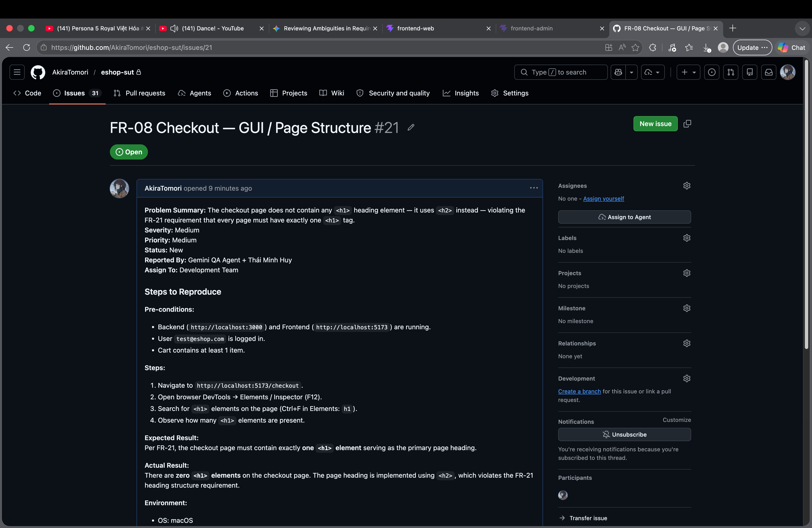
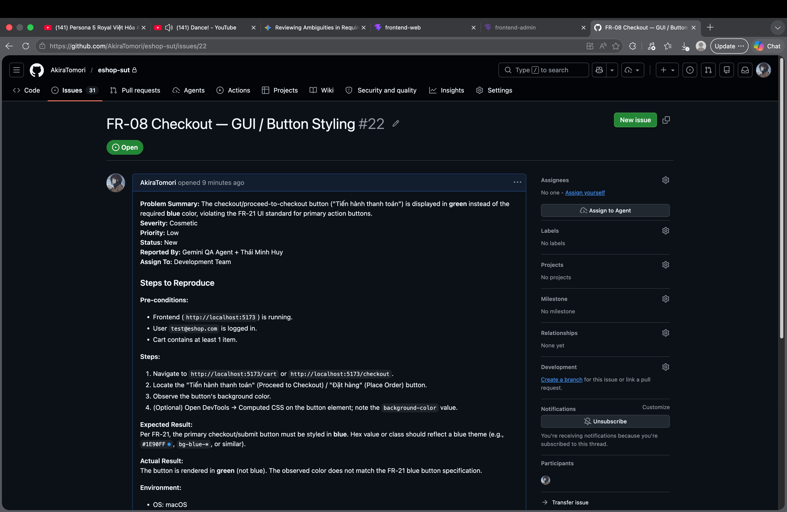
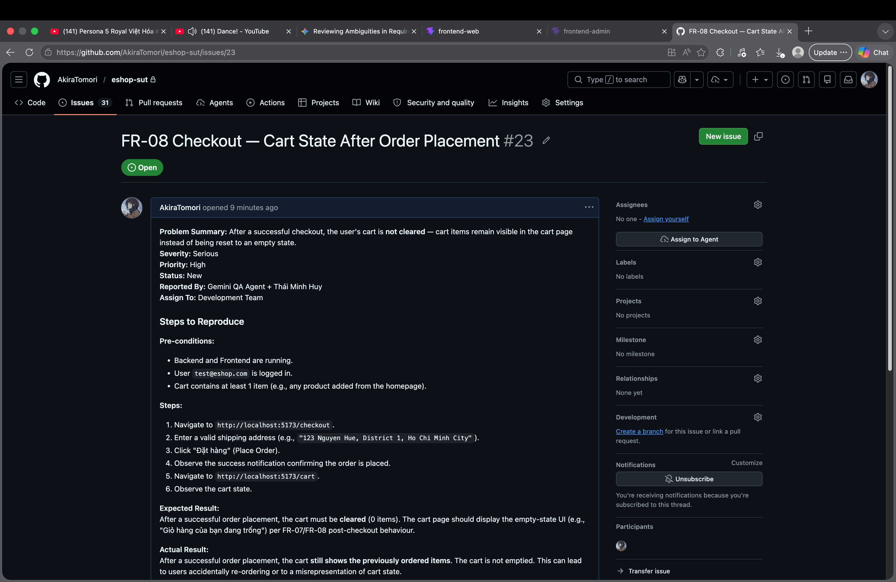
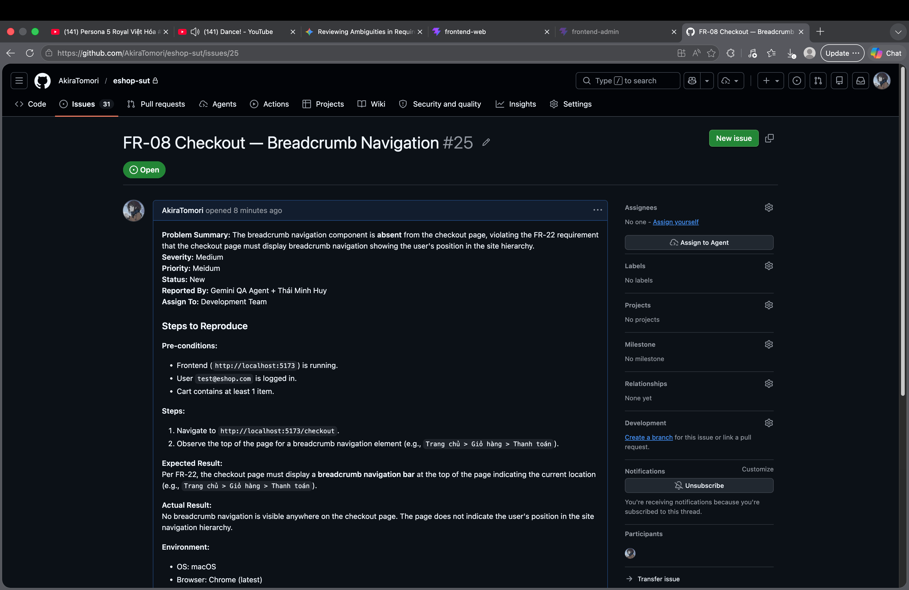
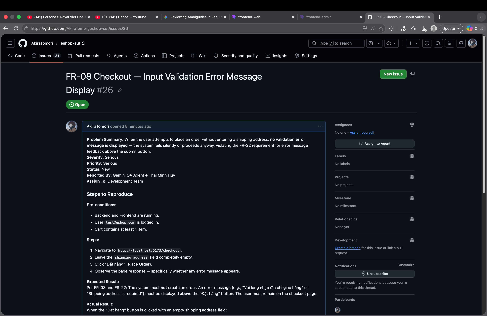
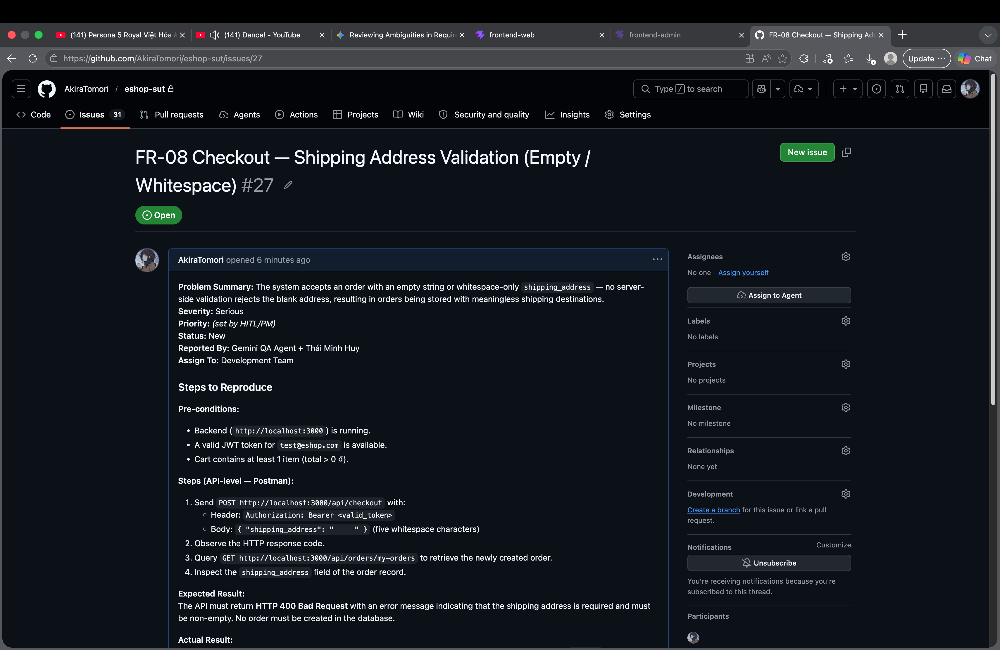
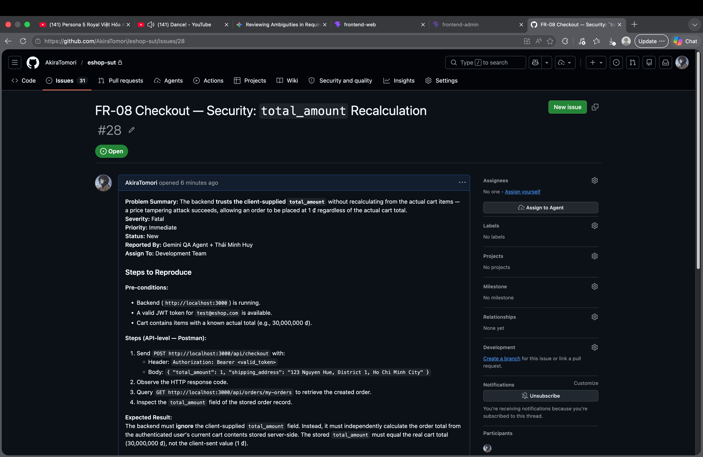
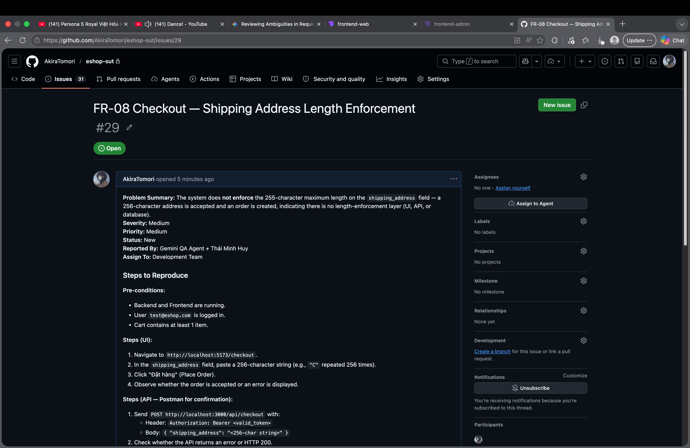

# Bug Report — FR-08: Checkout
**Pool:** B
**Test Cycle:** HW02 Domain Testing
**Tester:** Thái Minh Huy + Gemini QA Agent
**Execution Date:** 2026-06-14
**Revised:** 2026-06-15 — FR-09 coupon bug reports removed (BUG-FR08-004, BUG-FR08-010, BUG-FR08-011)

> **Scope:** This file contains bug reports from EP Test Cases (TC-FR08-EP-001 to TC-FR08-EP-003), NEG Test Cases (TC-FR08-NEG-001 to TC-FR08-NEG-007), and BV Test Cases Section BV-A: `shipping_address` Length Boundaries (TC-FR08-BV-001 to TC-FR08-BV-007).

---

## Bug Report: BUG-FR08-001
**Date:** 2026-06-14
**Function Name:** FR-08 Checkout — GUI / Page Structure
**Problem Summary:** The checkout page does not contain any `<h1>` heading element — it uses `<h2>` instead — violating the FR-21 requirement that every page must have exactly one `<h1>` tag.
**Severity:** Medium
**Priority:** Medium
**Status:** New
**Reported By:** Gemini QA Agent + Thái Minh Huy
**Assign To:** Development Team

### Steps to Reproduce

**Pre-conditions:**
- Backend (`http://localhost:3000`) and Frontend (`http://localhost:5173`) are running.
- User `test@eshop.com` is logged in.
- Cart contains at least 1 item.

**Steps:**
1. Navigate to `http://localhost:5173/checkout`.
2. Open browser DevTools → Elements / Inspector (F12).
3. Search for `<h1>` elements on the page (Ctrl+F in Elements: `h1`).
4. Observe how many `<h1>` elements are present.

**Expected Result:**
Per FR-21, the checkout page must contain exactly **one `<h1>` element** serving as the primary page heading.

**Actual Result:**
There are **zero `<h1>` elements** on the checkout page. The page heading is implemented using `<h2>`, which violates the FR-21 heading structure requirement.

**Environment:**
- OS: macOS
- Browser: Chrome (latest)
- App URL: `http://localhost:5173/checkout`
- Test Data: Authenticated user; non-empty cart.

**GitHub Issue:** https://github.com/AkiraTomori/eshop-sut/issues/21
**Linked Test Cases:** TC-FR08-EP-001, TC-FR08-NEG-007
**Attachments:** 

---

## Bug Report: BUG-FR08-002
**Date:** 2026-06-14
**Function Name:** FR-08 Checkout — GUI / Button Styling
**Problem Summary:** The checkout/proceed-to-checkout button ("Tiến hành thanh toán") is displayed in **green** instead of the required **blue** color, violating the FR-21 UI standard for primary action buttons.
**Severity:** Cosmetic
**Priority:** Low
**Status:** New
**Reported By:** Gemini QA Agent + Thái Minh Huy
**Assign To:** Development Team

### Steps to Reproduce

**Pre-conditions:**
- Frontend (`http://localhost:5173`) is running.
- User `test@eshop.com` is logged in.
- Cart contains at least 1 item.

**Steps:**
1. Navigate to `http://localhost:5173/cart` or `http://localhost:5173/checkout`.
2. Locate the "Tiến hành thanh toán" (Proceed to Checkout) / "Đặt hàng" (Place Order) button.
3. Observe the button's background color.
4. (Optional) Open DevTools → Computed CSS on the button element; note the `background-color` value.

**Expected Result:**
Per FR-21, the primary checkout/submit button must be styled in **blue**. Hex value or class should reflect a blue theme (e.g., `#1E90FF`, `bg-blue-*`, or similar).

**Actual Result:**
The button is rendered in **green** (not blue). The observed color does not match the FR-21 blue button specification.

**Environment:**
- OS: macOS
- Browser: Chrome (latest)
- App URL: `http://localhost:5173/cart` and `http://localhost:5173/checkout`
- Test Data: Authenticated user; non-empty cart.

**GitHub Issue:** https://github.com/AkiraTomori/eshop-sut/issues/22
**Linked Test Cases:** TC-FR08-EP-001, TC-FR08-NEG-007
**Attachments:** 

---

## Bug Report: BUG-FR08-003
**Date:** 2026-06-14
**Function Name:** FR-08 Checkout — Cart State After Order Placement
**Problem Summary:** After a successful checkout, the user's cart is **not cleared** — cart items remain visible in the cart page instead of being reset to an empty state.
**Severity:** Serious
**Priority:** Serious
**Status:** New
**Reported By:** Gemini QA Agent + Thái Minh Huy
**Assign To:** Development Team

### Steps to Reproduce

**Pre-conditions:**
- Backend and Frontend are running.
- User `test@eshop.com` is logged in.
- Cart contains at least 1 item (e.g., any product added from the homepage).

**Steps:**
1. Navigate to `http://localhost:5173/checkout`.
2. Enter a valid shipping address (e.g., `"123 Nguyen Hue, District 1, Ho Chi Minh City"`).
3. Click "Đặt hàng" (Place Order).
4. Observe the success notification confirming the order is placed.
5. Navigate to `http://localhost:5173/cart`.
6. Observe the cart state.

**Expected Result:**
After a successful order placement, the cart must be **cleared** (0 items). The cart page should display the empty-state UI (e.g., "Giỏ hàng của bạn đang trống") per FR-07/FR-08 post-checkout behaviour.

**Actual Result:**
After a successful order placement, the cart **still shows the previously ordered items**. The cart is not emptied. This can lead to users accidentally re-ordering or to a misrepresentation of cart state.

**Environment:**
- OS: macOS
- Browser: Chrome (latest)
- App URL: `http://localhost:5173/checkout` → `http://localhost:5173/cart`
- Test Data: `shipping_address` = `"123 Nguyen Hue, District 1, Ho Chi Minh City"`; at least 1 product in cart.

**GitHub Issue:** https://github.com/AkiraTomori/eshop-sut/issues/23
**Linked Test Cases:** TC-FR08-EP-001
**Attachments:** 

---

## Bug Report: BUG-FR08-005
**Date:** 2026-06-14
**Function Name:** FR-08 Checkout — Breadcrumb Navigation
**Problem Summary:** The breadcrumb navigation component is **absent** from the checkout page, violating the FR-22 requirement that the checkout page must display breadcrumb navigation showing the user's position in the site hierarchy.
**Severity:** Medium
**Priority:** Medium
**Status:** New
**Reported By:** Gemini QA Agent + Thái Minh Huy
**Assign To:** Development Team

### Steps to Reproduce

**Pre-conditions:**
- Frontend (`http://localhost:5173`) is running.
- User `test@eshop.com` is logged in.
- Cart contains at least 1 item.

**Steps:**
1. Navigate to `http://localhost:5173/checkout`.
2. Observe the top of the page for a breadcrumb navigation element (e.g., `Trang chủ > Giỏ hàng > Thanh toán`).

**Expected Result:**
Per FR-22, the checkout page must display a **breadcrumb navigation bar** at the top of the page indicating the current location (e.g., `Trang chủ > Giỏ hàng > Thanh toán`).

**Actual Result:**
No breadcrumb navigation is visible anywhere on the checkout page. The page does not indicate the user's position in the site navigation hierarchy.

**Environment:**
- OS: macOS
- Browser: Chrome (latest)
- App URL: `http://localhost:5173/checkout`
- Test Data: Authenticated user; non-empty cart.

**GitHub Issue:** https://github.com/AkiraTomori/eshop-sut/issues/25
**Linked Test Cases:** TC-FR08-EP-003
**Attachments:** 

---

## Bug Report: BUG-FR08-006
**Date:** 2026-06-14
**Function Name:** FR-08 Checkout — Input Validation Error Message Display
**Problem Summary:** When the user attempts to place an order without entering a shipping address, **no validation error message is displayed** — the system fails silently or proceeds anyway, violating the FR-22 requirement for error message feedback above the submit button.
**Severity:** Serious
**Priority:** Serious
**Status:** New
**Reported By:** Gemini QA Agent + Thái Minh Huy
**Assign To:** Development Team

### Steps to Reproduce

**Pre-conditions:**
- Backend and Frontend are running.
- User `test@eshop.com` is logged in.
- Cart contains at least 1 item.

**Steps:**
1. Navigate to `http://localhost:5173/checkout`.
2. Leave the `shipping_address` field completely empty.
3. Click "Đặt hàng" (Place Order).
4. Observe the page response — specifically whether any error message appears.

**Expected Result:**
Per FR-08 and FR-22: The system must **not** create an order. An error message (e.g., "Vui lòng nhập địa chỉ giao hàng" or "Shipping address is required") must be displayed **above** the "Đặt hàng" button. The user must remain on the checkout page.

**Actual Result:**
When the "Đặt hàng" button is clicked with an empty shipping address field:
- **No error message is displayed** anywhere on the page.
- The system **still creates an order** with an empty/null shipping address stored in the database.
- The user is not notified of the validation failure.

**Environment:**
- OS: macOS
- Browser: Chrome (latest)
- App URL: `http://localhost:5173/checkout`
- Test Data: `shipping_address` = `""` (empty string); authenticated user; non-empty cart.

**GitHub Issue:** https://github.com/AkiraTomori/eshop-sut/issues/26
**Linked Test Cases:** TC-FR08-NEG-004, TC-FR08-NEG-006, TC-FR08-BV-005
**Attachments:** 

> **Note:** This defect also reproduces with a whitespace-only address (`"     "`) — see TC-FR08-NEG-006. Both empty and whitespace-only inputs fail to trigger validation. The root cause is likely a single missing validation rule in the frontend and/or backend input processing.

---

## Bug Report: BUG-FR08-007
**Date:** 2026-06-14
**Function Name:** FR-08 Checkout — Shipping Address Validation (Empty / Whitespace)
**Problem Summary:** The system accepts an order with an empty string or whitespace-only `shipping_address` — no server-side validation rejects the blank address, resulting in orders being stored with meaningless shipping destinations.
**Severity:** Serious
**Priority:** Serious
**Status:** New
**Reported By:** Gemini QA Agent + Thái Minh Huy
**Assign To:** Development Team

### Steps to Reproduce

**Pre-conditions:**
- Backend (`http://localhost:3000`) is running.
- A valid JWT token for `test@eshop.com` is available.
- Cart contains at least 1 item (total > 0 ₫).

**Steps (API-level — Postman):**
1. Send `POST http://localhost:3000/api/checkout` with:
   - Header: `Authorization: Bearer <valid_token>`
   - Body: `{ "shipping_address": "     " }` (five whitespace characters)
2. Observe the HTTP response code.
3. Query `GET http://localhost:3000/api/orders/my-orders` to retrieve the newly created order.
4. Inspect the `shipping_address` field of the order record.

**Expected Result:**
The API must return **HTTP 400 Bad Request** with an error message indicating that the shipping address is required and must be non-empty. No order must be created in the database.

**Actual Result:**
The API returns **HTTP 200 OK**. An order is created in the database with the shipping address stored as `"     "` (five whitespace characters). No validation error is returned. The same behaviour is reproduced with `""` (empty string).

**Environment:**
- OS: macOS
- API Tool: Postman
- API Base URL: `http://localhost:3000`
- Test Data: `shipping_address` = `"     "` (whitespace-only) and `""` (empty string); valid JWT.

**GitHub Issue:** https://github.com/AkiraTomori/eshop-sut/issues/27
**Linked Test Cases:** TC-FR08-NEG-004, TC-FR08-NEG-006, TC-FR08-BV-005
**Attachments:** 

> **Note:** BUG-FR08-006 (no frontend error message) and BUG-FR08-007 (no backend validation) are separate defects. BUG-FR08-006 is a UI/frontend gap; BUG-FR08-007 is a backend/API gap. Both must be fixed independently.

---

## Bug Report: BUG-FR08-008
**Date:** 2026-06-14
**Function Name:** FR-08 Checkout — Security: `total_amount` Recalculation
**Problem Summary:** The backend **trusts the client-supplied `total_amount`** without recalculating from the actual cart items — a price tampering attack succeeds, allowing an order to be placed at 1 ₫ regardless of the actual cart total.
**Severity:** Fatal
**Priority:** Immediate
**Status:** New
**Reported By:** Gemini QA Agent + Thái Minh Huy
**Assign To:** Development Team

### Steps to Reproduce

**Pre-conditions:**
- Backend (`http://localhost:3000`) is running.
- A valid JWT token for `test@eshop.com` is available.
- Cart contains items with a known actual total (e.g., 30,000,000 ₫).

**Steps (API-level — Postman):**
1. Send `POST http://localhost:3000/api/checkout` with:
   - Header: `Authorization: Bearer <valid_token>`
   - Body: `{ "total_amount": 1, "shipping_address": "123 Nguyen Hue, District 1, Ho Chi Minh City" }`
2. Observe the HTTP response code.
3. Query `GET http://localhost:3000/api/orders/my-orders` to retrieve the created order.
4. Inspect the `total_amount` field of the stored order record.

**Expected Result:**
The backend must **ignore** the client-supplied `total_amount` field. Instead, it must independently calculate the order total from the authenticated user's current cart contents stored server-side. The stored `total_amount` must equal the real cart total (30,000,000 ₫), not the client-sent value (1 ₫).

**Actual Result:**
The API returns **HTTP 200 OK**. The order is created with `total_amount = 1 ₫` — the exact value sent by the client. The backend does **not** recalculate the total from the cart. This constitutes a **critical price tampering vulnerability**: any authenticated user can place any order for 1 ₫.

**Environment:**
- OS: macOS
- API Tool: Postman
- API Base URL: `http://localhost:3000`
- Test Data: Tampered `total_amount` = 1; actual cart total = 30,000,000 ₫; valid JWT for `test@eshop.com`.

**GitHub Issue:** https://github.com/AkiraTomori/eshop-sut/issues/28
**Linked Test Cases:** TC-FR08-NEG-005
**Attachments:** 

> ⚠️ **Security Escalation Required (TR-BP-09):** This is a Fatal security defect — price tampering vulnerability. Per senior QA best practice, this defect must be **escalated immediately** to the team lead or security officer and must not be deferred. The checkout endpoint must be patched before any production deployment.

---

## Bug Report: BUG-FR08-009
**Date:** 2026-06-14
**Function Name:** FR-08 Checkout — Shipping Address Length Enforcement
**Problem Summary:** The system does **not enforce** the 255-character maximum length on the `shipping_address` field — a 256-character address is accepted and an order is created, indicating there is no length-enforcement layer (UI, API, or database).
**Severity:** Medium
**Priority:** Medium
**Status:** New
**Reported By:** Gemini QA Agent + Thái Minh Huy
**Assign To:** Development Team

### Steps to Reproduce

**Pre-conditions:**
- Backend and Frontend are running.
- User `test@eshop.com` is logged in.
- Cart contains at least 1 item.

**Steps (UI):**
1. Navigate to `http://localhost:5173/checkout`.
2. In the `shipping_address` field, paste a 256-character string (e.g., `"C"` repeated 256 times).
3. Click "Đặt hàng" (Place Order).
4. Observe whether the order is accepted or an error is displayed.

**Steps (API — Postman for confirmation):**
1. Send `POST http://localhost:3000/api/checkout` with:
   - Header: `Authorization: Bearer <valid_token>`
   - Body: `{ "shipping_address": "<256-char string>" }`
2. Check whether the API returns an error or HTTP 200.
3. Query the stored order to verify whether the full 256-char address is stored.

**Expected Result:**
Per the HITL-resolved 255-character baseline: The system must **reject** a 256-character shipping address. Either:
- The UI must prevent input beyond 255 characters (via `maxlength` attribute), or
- The API must return HTTP 400 with an error message indicating the address is too long, or
- The database must enforce the constraint at the schema level.
At least one enforcement layer must exist.

**Actual Result:**
The system accepts the 256-character address without any error. An order is created successfully with the full over-length address stored in the database. **No enforcement layer** (UI, API, or database) rejects the over-length input.

> Additionally, a 1000-character address was also accepted without error (TC-FR08-BV-007), confirming there is no length limit enforcement at any layer.

**Environment:**
- OS: macOS
- Browser: Chrome (latest) + Postman
- App URL: `http://localhost:5173/checkout` and `http://localhost:3000/api/checkout`
- Test Data: `shipping_address` = 256-char string (`"C" × 256`) and 1000-char string.

**GitHub Issue:** https://github.com/AkiraTomori/eshop-sut/issues/29
**Linked Test Cases:** TC-FR08-BV-006, TC-FR08-BV-007
**Attachments:** 

---

## Bug Summary Table (Full Scope: EP + NEG + BV-A)

| Bug ID | TC(s) | Feature Area | Problem Summary | Severity | Status |
|--------|-------|-------------|-----------------|:--------:|--------|
| BUG-FR08-001 | EP-001, NEG-007 | GUI / Page Structure | No `<h1>` on checkout page — uses `<h2>` instead | Medium | New |
| BUG-FR08-002 | EP-001, NEG-007 | GUI / Button Styling | Checkout button is green instead of blue | Cosmetic | New |
| BUG-FR08-003 | EP-001 | Cart State Post-Checkout | Cart not cleared after successful order placement | Serious | New |
| BUG-FR08-005 | EP-003 | GUI / Breadcrumb Navigation | Breadcrumb navigation absent from checkout page | Medium | New |
| BUG-FR08-006 | EP-003, NEG-004, NEG-006, BV-005 | Input Validation / UI Error Display | No UI error message when shipping address is empty/whitespace | Serious | New |
| BUG-FR08-007 | NEG-004, NEG-006, BV-005 | Backend Input Validation | API accepts orders with empty/whitespace shipping_address | Serious | New |
| BUG-FR08-008 | NEG-005 | Security / Price Tampering | Backend trusts client-supplied total_amount — price tampering succeeds | **Fatal** | New |
| BUG-FR08-009 | BV-006, BV-007 | Input Validation / Length | No enforcement of 255-char max on shipping_address | Medium | New |

**Total bugs: 8**

| Severity | Count |
|----------|:-----:|
| Fatal | **1** (BUG-FR08-008) |
| Serious | **3** (BUG-FR08-003, 006, 007) |
| Medium | **3** (BUG-FR08-001, 005, 009) |
| Cosmetic | **1** (BUG-FR08-002) |

---

**HITL Action Required:**
1. File a **GitHub Issue** for each of the 8 bugs and paste the issue URL into the corresponding `GitHub Issue:` field.
2. Attach a **screenshot or screen recording** to each GitHub Issue.
3. Prioritize **BUG-FR08-008** (Fatal — price tampering) for **immediate escalation** before any other fix.
4. Update the `Bug ID:` field in [FR08-test-cases.md](FR08-test-cases.md) for each failed test case.

**HITL Review:** Accepted
