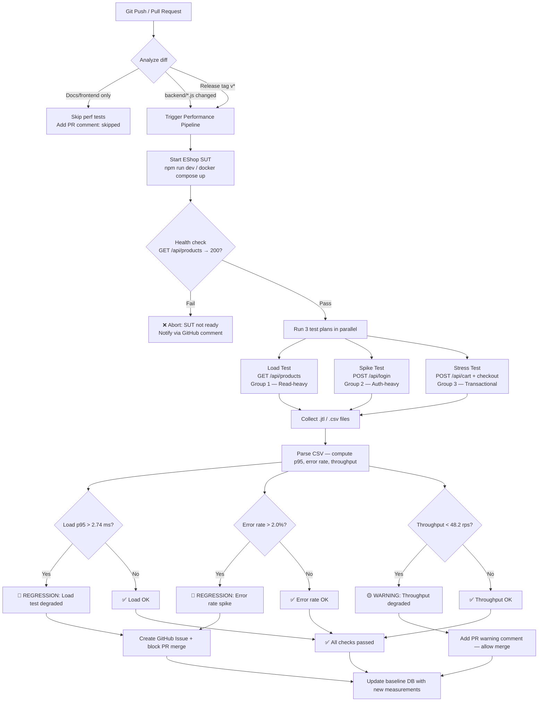

# Continuous Performance Testing Pipeline Proposal

This proposal outlines the strategy for integrating performance testing into EShop's CI/CD pipeline, utilizing empirical measurements obtained during HW05.

## 1. Trigger Decision Matrix

To optimize CI resources while preventing regressions, tests are conditionally triggered based on commit contents:

| Commit type | Trigger test? | Reason |
|---|---|---|
| Only `.md`, docs changes | ❌ No | Does not affect backend API behavior. |
| Changes to `backend/routes/*.js` | ✅ Yes — Full suite | Core route changes may degrade API response time. |
| Changes to `backend/db.js` | ✅ Yes — Full suite | Database access patterns directly affect SQLite lock contention. |
| Changes to `frontend-web/` only | ⚠️ Load test only | Frontend tweaks might alter read-heavy API request patterns. |
| Release tag `v*` | ✅ Yes — Full + Stress | Thorough breaking point validation before deployment. |
| Nightly schedule (2 AM) | ✅ Yes — Full + Endurance | Discover long-term memory leaks during off-peak hours. |

## 2. CI Pipeline Flowchart



*(Note: Thresholds used in the flowchart are calculated as `measured_value * 1.2` for p95, and `measured_value * 0.9` for throughput based on our Skill 4 logs).*

## 3. Baseline Performance Thresholds (`baseline_thresholds.yaml`)

```yaml
version: "1.0"
measured_on: "2026-08-16"
hardware: "macOS, Apple M5, 16GB RAM"

load_test:
  endpoint: "GET /api/products"
  p95_ms: 2.286
  p95_regression_threshold_ms: 2.743   # +20% buffer
  error_rate_percent: 0.00
  throughput_rps: 53.56

spike_test:
  endpoint: "PUT /api/users/me"
  p95_ms: 5.744
  recovery_time_s: 120
  lockout_events_per_run: 0

stress_test:
  endpoint: "POST /api/cart → POST /api/checkout"
  max_stable_users: 200
  breaking_point_users: "> 200"
  p95_at_stable_ms: 34.7

endurance:
  max_stable_rps: 55
  memory_ceiling_mb: 120
  duration_minutes: 15
```

## 4. Trade-off Analysis: Cost vs False Alarm Rate

| Strategy | Cost | False Alarm Rate | Pipeline Duration | Best For |
|---|---|---|---|---|
| **Run after every commit** | High | Low | ~15 min/run | Large team, high SLA |
| **Backend changes only** *(Recommended)* | Medium | Medium | ~15 min/run (less frequent) | EShop-sized project |
| **Release tags only** | Low | High (misses regressions between releases) | ~15 min/release | Early-stage startup |
| **Nightly scheduled** | Low | High (delayed detection) | ~30 min/night | Combine with option 2 |
| **Load test only, skip Stress/Spike** | Low | High for spike/stress regressions | ~5 min/run | Not recommended |

### Recommended Strategy for EShop
EShop utilizes SQLite and a single-process Node.js backend. Test runs are relatively cheap (~15 min total). 
**Recommendation: Strategy 2 (Backend changes) + Nightly schedule**:
- **On PR to `backend/`**: Run Load + Spike (~10 min). Blocks merges if p95 spikes.
- **Nightly at 2 AM**: Full suite + 15-min endurance test.
- **Pre-release (`v*`)**: Full suite + 200 VU Stress test to certify limits.

### Known False Alarm Sources
1. **Hardware variance**: Results differ slightly across runner environments. **Mitigation**: Implemented a `+20%` buffer for all p95 thresholds (e.g., `2.28ms` → `2.74ms`).
2. **Concurrent CI processes**: Other actions running on the self-hosted node skew CPU metrics. **Mitigation**: Isolate the test environment or use dedicated GitHub Action runners.
3. **Cold start effect**: First request to SQLite takes longer as it initializes the page cache. **Mitigation**: Add a 30s warm-up stage in k6 before evaluating metrics.
4. **SQLite lock accumulation**: Running Stress followed immediately by Spike without cleanup. **Mitigation**: Reset backend DB state between group executions.

## 5. GitHub Actions Implementation Sketch

```yaml
name: Performance Regression Check
on:
  push:
    paths: ['backend/**', 'compose.yaml']
  schedule:
    - cron: '0 19 * * *'  # 2AM GMT+7

jobs:
  performance:
    runs-on: self-hosted
    steps:
      - uses: actions/checkout@v4
      - name: Start EShop
        run: bash run_servers.sh && sleep 10
      - name: Health check
        run: curl -f http://localhost:3000/api/products
      - name: Run Load Test
        run: k6 run --out csv=results/load.csv 23127379_Load_20260813.js
      - name: Check regression
        run: python3 scripts/parse_k6_csv.py results/load.csv --check-regression
      - name: Upload artifacts
        uses: actions/upload-artifact@v4
        with:
          name: perf-results-${{ github.sha }}
          path: results/
```
