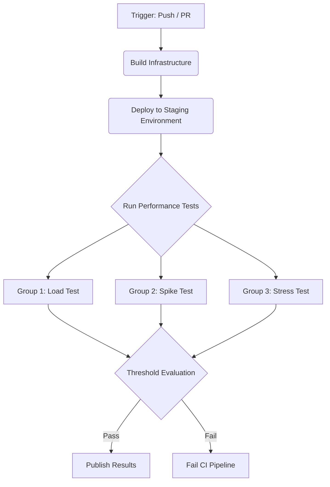

# HW05 — Continuous Integration Performance Pipeline Proposal

## 1. Flowchart

*(Mermaid flowchart goes here showing the CI stages: Build -> Setup -> Load -> Spike -> Stress -> Publish)*

## 2. Performance Quality Gates

*(Thresholds must be grounded in actual measured values from the execution logs)*

| Scenario | Metric | Threshold | Current Baseline | Rationale |
|---|---|---|---|---|
| Load Testing | p95 Response Time | `< [TBD] ms` | *(TBD)* ms | Ensures normal browsing remains fast under sustained load. |
| Spike Testing | Recovery Time | `< [TBD] s` | *(TBD)* s | Measures how quickly the system stabilizes after a traffic surge. |
| Stress Testing | Error Rate | `< [TBD] %` | *(TBD)* % | Establishes the acceptable failure limit during overload. |

## 3. Trade-off Analysis

*(Discuss the trade-offs of running full performance tests in CI: build time vs. feedback speed, environment consistency, test data isolation vs. production realism)*
