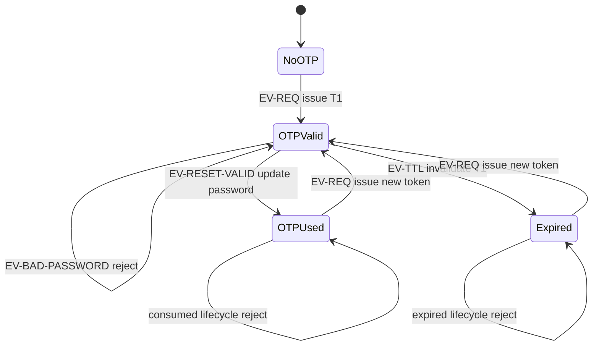

# Pool A / FR-03 — State Transition Testing Proposal

> Scope: `POST /api/forgot-password` and `POST /api/reset-password` only. No API request has been executed, no real time/data has been manipulated, and no GET request is designed.

## Specification basis and modeling rules

- Root `README.md` §FR-03 requires a two-step password-recovery workflow, a random six-digit OTP, and binding of the OTP to the email that requested it.
- Root `README.md` §SEC-07 requires the reset OTP to have a lifetime and to be invalidated after use.
- Root `api_specification.md` §1.3 defines `POST /api/forgot-password` and its successful `200` response. Section 1.4 defines the reset request body but does not define a success status or response schema.
- The exact OTP TTL, expiration mechanism, failed-attempt policy, retry limit, behavior of an older token after reissue, and all reset/failure status codes are not specified.
- `OTPUsed` and `Expired` are terminal for one token, not for the overall recovery workflow: a later valid OTP request starts a new token lifecycle.
- When a wrong email, wrong token, or invalid password is submitted while a valid OTP exists, rejection is required by FR-03/FR-01. Retaining the valid OTP is a tester-proposed state expectation because the specification does not say whether a failed reset consumes it.

## Fixtures and event vocabulary

| ID | Definition |
|---|---|
| `E1` | Registered recovery email, e.g. `test@eshop.com` |
| `E2` | Different registered email, e.g. `admin@eshop.com` |
| `T1` | Fresh six-digit OTP issued for `E1`; captured dynamically from the documented demo response |
| `T2` | A later six-digit OTP issued for `E1` |
| `TW` | Correctly formatted six-digit value known not to be the current token for `E1` |
| `P1` | Valid strong new password satisfying FR-01, e.g. `Aa1!bbbb` |
| `PI` | Invalid new password, e.g. `alllowercase` |

| Event ID | Event | Trigger/guard | Specification status |
|---|---|---|---|
| EV-REQ | `requestOtp` | `POST /api/forgot-password` with `E1` | Documented valid workflow event |
| EV-RESET-VALID | `resetWithLifecycleToken` | `POST /api/reset-password` using the token belonging to the modeled lifecycle, matching `E1`, and `P1` | Valid only while that token is in `OTPValid`; in `OTPUsed` it is reuse and in `Expired` it is an expired-token attempt |
| EV-WRONG-EMAIL | `resetWithWrongEmail` | Submit lifecycle token with `E2` and `P1` | Must be rejected by FR-03 binding rule |
| EV-WRONG-TOKEN | `resetWithWrongToken` | Submit `TW` with `E1` and `P1` | Must not reset because the value was not issued for this lifecycle |
| EV-BAD-PASSWORD | `resetWithInvalidPassword` | Submit lifecycle token with `E1` and `PI` | Must be rejected by FR-03 → FR-01; token-consumption behavior unspecified |
| EV-TTL | `ttlElapsed` | Configured OTP lifetime elapses | Required by SEC-07; concrete duration/mechanism unspecified |

## FSM definition

| State | Meaning | Initial/Final | Basis/assumption requiring confirmation |
|---|---|---|---|
| `NoOTP` | No currently usable OTP exists for `E1` in the modeled lifecycle | Initial | Required starting model from the skill; storage representation unspecified |
| `OTPValid` | A six-digit OTP exists, is bound to `E1`, is within its lifetime, and has not been successfully consumed | Non-final | FR-03 and SEC-07; multiple-active-token behavior unspecified |
| `OTPUsed` | The lifecycle token completed a successful password reset and is invalidated | Terminal for that token | SEC-07 explicitly requires invalidation after use |
| `Expired` | The lifecycle token exceeded its configured lifetime and is unusable | Terminal for that token | SEC-07 requires a lifetime; TTL value and eager/lazy expiration are unspecified |

## Complete State Table

The table contains every state × event cell: 4 states × 6 events = 24 transitions.

| Transition ID | Current State | Event | Guard/Test data | Valid? | Expected State | Expected response/side effect | Source |
|---|---|---|---|---|---|---|---|
| FR03-TR-01 | `NoOTP` | EV-REQ | Registered `E1` | Yes | `OTPValid` | `200`; documented message and six-digit token; usable token issued for `E1` | README FR-03; API spec §1.3 |
| FR03-TR-02 | `NoOTP` | EV-RESET-VALID | Submit `E1`, a six-digit value, and `P1` without any issued OTP | No | `NoOTP` | Reject; no password change; exact status/schema unspecified | README FR-03 |
| FR03-TR-03 | `NoOTP` | EV-WRONG-EMAIL | Submit `E2`, a six-digit value, and `P1`; no current OTP exists | No | `NoOTP` | Reject; no password change; validation precedence unspecified | README FR-03 |
| FR03-TR-04 | `NoOTP` | EV-WRONG-TOKEN | Submit `E1`, `TW`, and `P1`; no current OTP exists | No | `NoOTP` | Reject; no password change; exact status/schema unspecified | README FR-03 |
| FR03-TR-05 | `NoOTP` | EV-BAD-PASSWORD | Submit `E1`, a six-digit value, and `PI`; no current OTP exists | No | `NoOTP` | Reject; no password change; state-vs-password validation precedence unspecified | README FR-03 → FR-01 |
| FR03-TR-06 | `NoOTP` | EV-TTL | Let a configured TTL interval elapse without an OTP | No / no-op | `NoOTP` | No API response and no state change | SEC-07; tester-proposed no-op |
| FR03-TR-07 | `OTPValid` | EV-REQ | `T1` is still valid; request another token for `E1` | Yes | `OTPValid` for `T2` | `200`; a token is returned; whether `T1` is invalidated or coexists is unspecified | README FR-03; API spec §1.3 |
| FR03-TR-08 | `OTPValid` | EV-RESET-VALID | Submit `E1`, `T1`, and `P1` before expiry | Yes | `OTPUsed` | Password changes; `T1` becomes unusable; reset status/schema unspecified | README FR-03; SEC-07; API spec §1.4 |
| FR03-TR-09 | `OTPValid` | EV-WRONG-EMAIL | Submit `E2`, `T1`, and `P1` | No | `OTPValid` (proposed) | Reject and do not change either password; whether failed binding consumes `T1` is unspecified | README FR-03 |
| FR03-TR-10 | `OTPValid` | EV-WRONG-TOKEN | Submit `E1`, `TW`, and `P1` | No | `OTPValid` (proposed) | Reject and do not change password; failed-attempt/token-retention policy unspecified | README FR-03 |
| FR03-TR-11 | `OTPValid` | EV-BAD-PASSWORD | Submit `E1`, `T1`, and `PI` | No | `OTPValid` (proposed) | Reject weak password; no password change; whether rejection consumes `T1` is unspecified | README FR-03 → FR-01 |
| FR03-TR-12 | `OTPValid` | EV-TTL | Let the configured lifetime of `T1` elapse unused | Yes | `Expired` | `T1` becomes unusable; no direct API response; TTL value/mechanism unspecified | SEC-07 |
| FR03-TR-13 | `OTPUsed` | EV-REQ | Request another token for `E1` after successful reset | Yes | `OTPValid` for a new token | `200`; new recovery lifecycle begins | README FR-03; API spec §1.3 |
| FR03-TR-14 | `OTPUsed` | EV-RESET-VALID | Re-submit consumed `T1` with `E1` and another valid password | No | `OTPUsed` | Reject replay; password remains the value set by the first success; status/schema unspecified | SEC-07 |
| FR03-TR-15 | `OTPUsed` | EV-WRONG-EMAIL | Submit consumed `T1` with `E2` and `P1` | No | `OTPUsed` | Reject; neither password changes; rejection precedence unspecified | FR-03; SEC-07 |
| FR03-TR-16 | `OTPUsed` | EV-WRONG-TOKEN | Submit `TW` with `E1` and `P1` | No | `OTPUsed` | Reject; password unchanged | FR-03; SEC-07 |
| FR03-TR-17 | `OTPUsed` | EV-BAD-PASSWORD | Submit consumed `T1` with `E1` and `PI` | No | `OTPUsed` | Reject; password unchanged; state-vs-password validation precedence unspecified | FR-01; SEC-07 |
| FR03-TR-18 | `OTPUsed` | EV-TTL | Let more time elapse after `T1` was consumed | No / no-op | `OTPUsed` | No API response; consumed token must not regain validity | SEC-07 |
| FR03-TR-19 | `Expired` | EV-REQ | Request another token for `E1` after `T1` expired | Yes | `OTPValid` for a new token | `200`; new recovery lifecycle begins | README FR-03; API spec §1.3 |
| FR03-TR-20 | `Expired` | EV-RESET-VALID | Submit expired `T1` with `E1` and `P1` | No | `Expired` | Reject; no password change; status/schema unspecified | SEC-07 |
| FR03-TR-21 | `Expired` | EV-WRONG-EMAIL | Submit expired `T1` with `E2` and `P1` | No | `Expired` | Reject; neither password changes; rejection precedence unspecified | FR-03; SEC-07 |
| FR03-TR-22 | `Expired` | EV-WRONG-TOKEN | Submit `TW` with `E1` and `P1` | No | `Expired` | Reject; password unchanged | FR-03; SEC-07 |
| FR03-TR-23 | `Expired` | EV-BAD-PASSWORD | Submit expired `T1` with `E1` and `PI` | No | `Expired` | Reject; password unchanged; state-vs-password validation precedence unspecified | FR-01; SEC-07 |
| FR03-TR-24 | `Expired` | EV-TTL | Let more time elapse after `T1` expired | No / no-op | `Expired` | No API response; expired token must not regain validity | SEC-07 |

## 0-switch and invalid-transition test cases

Every transition table row has one proposed representative. `ttlElapsed` cases require the real configured TTL or an approved controllable clock; neither is invented here.

| Test Case ID | Coverage type | Transition ID | Setup state | Request sequence | Expected states | Expected status/response | Requirement source |
|---|---|---|---|---|---|---|---|
| FR03-ST-001 | 0-switch valid | FR03-TR-01 | Ensure no current OTP for `E1` | POST forgot-password with `E1` | `NoOTP → OTPValid` | `200` and documented message/token shape | FR-03; API spec §1.3 |
| FR03-ST-002 | Invalid transition | FR03-TR-02 | `NoOTP` | POST reset-password with `E1`, six-digit placeholder, `P1` | `NoOTP → NoOTP` | Reject; no password change; status/schema unspecified | FR-03 |
| FR03-ST-003 | Invalid transition | FR03-TR-03 | `NoOTP` | POST reset-password with `E2`, six-digit placeholder, `P1` | `NoOTP → NoOTP` | Reject; no password change; precedence unspecified | FR-03 |
| FR03-ST-004 | Invalid transition | FR03-TR-04 | `NoOTP` | POST reset-password with `E1`, `TW`, `P1` | `NoOTP → NoOTP` | Reject; no password change; status/schema unspecified | FR-03 |
| FR03-ST-005 | Invalid transition | FR03-TR-05 | `NoOTP` | POST reset-password with `E1`, six-digit placeholder, `PI` | `NoOTP → NoOTP` | Reject; no password change; precedence unspecified | FR-03 → FR-01 |
| FR03-ST-006 | Invalid/no-op | FR03-TR-06 | `NoOTP` | Let the configured TTL interval elapse; send no request | `NoOTP → NoOTP` | No API response/state change | SEC-07; proposed no-op |
| FR03-ST-007 | 0-switch valid | FR03-TR-07 | Issue `T1` for `E1`; keep within TTL | POST forgot-password again with `E1`, capture `T2` | `OTPValid → OTPValid` | `200`; `T2` returned; validity of `T1` requires confirmation | FR-03; API spec §1.3 |
| FR03-ST-008 | 0-switch valid | FR03-TR-08 | Issue fresh `T1` for `E1` | POST reset-password with `E1`, `T1`, `P1` | `OTPValid → OTPUsed` | Password updated and `T1` invalidated; status/schema unspecified | FR-03; SEC-07 |
| FR03-ST-009 | Invalid transition | FR03-TR-09 | Issue fresh `T1` for `E1` | POST reset-password with `E2`, `T1`, `P1` | `OTPValid → OTPValid` proposed | Reject; neither password changes; retention unspecified | FR-03 |
| FR03-ST-010 | Invalid transition | FR03-TR-10 | Issue fresh `T1` for `E1` | POST reset-password with `E1`, `TW`, `P1` | `OTPValid → OTPValid` proposed | Reject; password unchanged; retention unspecified | FR-03 |
| FR03-ST-011 | Invalid transition | FR03-TR-11 | Issue fresh `T1` for `E1` | POST reset-password with `E1`, `T1`, `PI` | `OTPValid → OTPValid` proposed | Reject weak password; token retention unspecified | FR-03 → FR-01 |
| FR03-ST-012 | 0-switch valid | FR03-TR-12 | Issue fresh `T1` for `E1` | Wait beyond the real configured TTL; no API request | `OTPValid → Expired` | Token becomes unusable; TTL value/mechanism requires evidence | SEC-07 |
| FR03-ST-013 | 0-switch valid | FR03-TR-13 | Issue and successfully consume `T1` | POST forgot-password with `E1`, capture new token | `OTPUsed → OTPValid` | `200`; new token issued | FR-03; API spec §1.3 |
| FR03-ST-014 | Invalid transition | FR03-TR-14 | Issue and successfully consume `T1` | POST reset-password again with `E1`, `T1`, another valid password | `OTPUsed → OTPUsed` | Reject replay; password remains from first reset | SEC-07 |
| FR03-ST-015 | Invalid transition | FR03-TR-15 | Issue and successfully consume `T1` | POST reset-password with `E2`, consumed `T1`, `P1` | `OTPUsed → OTPUsed` | Reject; neither password changes; precedence unspecified | FR-03; SEC-07 |
| FR03-ST-016 | Invalid transition | FR03-TR-16 | Issue and successfully consume `T1` | POST reset-password with `E1`, `TW`, `P1` | `OTPUsed → OTPUsed` | Reject; password unchanged | FR-03; SEC-07 |
| FR03-ST-017 | Invalid transition | FR03-TR-17 | Issue and successfully consume `T1` | POST reset-password with `E1`, consumed `T1`, `PI` | `OTPUsed → OTPUsed` | Reject; password unchanged; precedence unspecified | FR-01; SEC-07 |
| FR03-ST-018 | Invalid/no-op | FR03-TR-18 | Issue and successfully consume `T1` | Let time elapse; send no request | `OTPUsed → OTPUsed` | No response; token never becomes valid again | SEC-07 |
| FR03-ST-019 | 0-switch valid | FR03-TR-19 | Issue `T1`, then wait beyond the real TTL | POST forgot-password with `E1`, capture new token | `Expired → OTPValid` | `200`; new token issued | FR-03; API spec §1.3 |
| FR03-ST-020 | Invalid transition | FR03-TR-20 | Issue `T1`, then wait beyond the real TTL | POST reset-password with `E1`, expired `T1`, `P1` | `Expired → Expired` | Reject; no password change; status/schema unspecified | SEC-07 |
| FR03-ST-021 | Invalid transition | FR03-TR-21 | Issue `T1`, then wait beyond the real TTL | POST reset-password with `E2`, expired `T1`, `P1` | `Expired → Expired` | Reject; neither password changes; precedence unspecified | FR-03; SEC-07 |
| FR03-ST-022 | Invalid transition | FR03-TR-22 | Issue `T1`, then wait beyond the real TTL | POST reset-password with `E1`, `TW`, `P1` | `Expired → Expired` | Reject; password unchanged | FR-03; SEC-07 |
| FR03-ST-023 | Invalid transition | FR03-TR-23 | Issue `T1`, then wait beyond the real TTL | POST reset-password with `E1`, expired `T1`, `PI` | `Expired → Expired` | Reject; password unchanged; precedence unspecified | FR-01; SEC-07 |
| FR03-ST-024 | Invalid/no-op | FR03-TR-24 | Issue `T1`, then wait beyond the real TTL | Let more time elapse; send no request | `Expired → Expired` | No response; token never becomes valid again | SEC-07 |

## Coverage and unresolved contract ledger

| Coverage item | Evidence | Status/gap |
|---|---|---|
| Every state × event cell | FR03-TR-01 through FR03-TR-24 | Complete: 24/24 |
| Every valid single transition (0-switch) | FR03-ST-001, 007, 008, 012, 013, 019 | Complete for the proposed model: 6/6 |
| Wrong email while OTP valid | FR03-TR/ST-09 | Rejection required; OTP retention unspecified |
| Wrong token while OTP valid | FR03-TR/ST-10 | Rejection required; OTP retention/retry policy unspecified |
| Expired token | FR03-TR/ST-20 | Required by SEC-07; TTL and clock control unspecified |
| Reused token | FR03-TR/ST-14 | Rejection and one-time invalidation required by SEC-07 |
| Reissue during `OTPValid` | FR03-TR/ST-07 | New issuance modeled; old-token invalidation/coexistence unspecified |
| Invalid password with valid OTP | FR03-TR/ST-11 | Password rejection required; OTP consumption unspecified |
| Reset success oracle | FR03-TR/ST-08 | Password update and token invalidation required; HTTP status/response schema unspecified |
| Failure oracle | All invalid transitions | No prohibited state change/password change; status/error schema unspecified |
| Confirmation-password field | Not modeled as API event | SRS requires UI confirmation, but API spec §1.4 defines no confirmation field |
| Execution without GET | All request sequences use only the two scoped POST endpoints | Compliant; internal state observability may require approved test hooks or follow-up POST behavior |

## Human confirmations needed before automation

1. Supply or confirm the concrete OTP TTL and how tests can deterministically cross it.
2. Define whether issuing `T2` invalidates `T1` or allows multiple active OTPs.
3. Define whether wrong-email, wrong-token, or invalid-password attempts consume/invalidate a still-valid OTP.
4. Define reset success and failure status codes/response schemas.
5. Define retry/rate-limit behavior and whether excessive failures introduce another state.

Status: Approved
