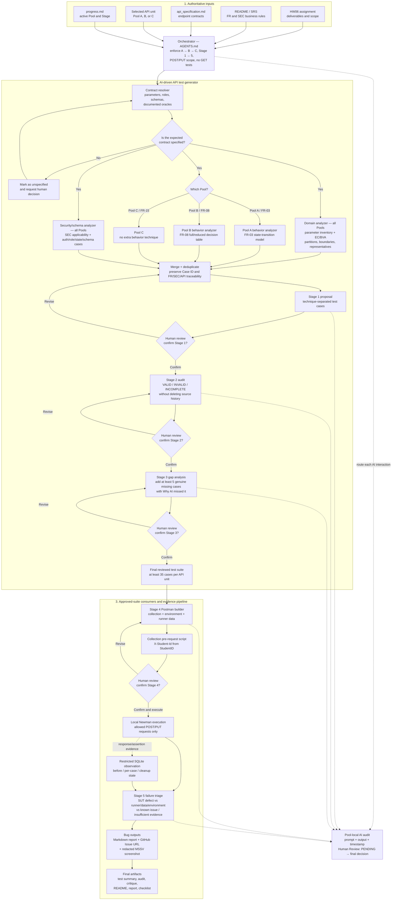

# HW06 AI-Driven API Test Generator Design

## Authorship constraint

The assignment requires the architecture diagram to be **self-drawn by the student**. AI must not generate the final diagram. Insert only the real student-created file/link below.

- Student-drawn diagram: `[USER ACTION REQUIRED: add PNG/drawing-tool export path]`
- Authorship evidence: `[USER ACTION REQUIRED: add screenshot/video evidence if available]`

## Reference architecture — use this to understand, then redraw it yourself

> **Reference only:** The Mermaid diagram below explains the architecture implemented in this homework. It is not the student-drawn submission artifact. Redraw the design in your own layout and notation, then replace the placeholder above with your real image path and authorship evidence.



### How to redraw it by hand

1. Divide the page into three large horizontal zones: **Inputs**, **AI Test Generator**, and **Execution/Evidence**.
2. Draw `AGENTS.md` as the controller between the inputs and generator; annotate it with `A → B → C`, `Stage 1 → 5`, and `No GET`.
3. In the generator zone, draw three parallel analysis branches: **Domain**, **State/Decision by Pool**, and **Security/Schema**.
4. Join those branches at **Merge + Deduplicate**, then draw the three human loops: Stage 1 review, Stage 2 audit, and Stage 3 extension.
5. Continue from the final `≥35 cases` box to Postman, Newman, SQLite evidence, failure triage, and reporting.
6. Draw the AI Audit as a side box with dashed arrows from each AI-assisted stage. Use a different color for human decision diamonds so your responsibility is visually obvious.

### Meaning of the main paths

- **Pool A / FR-03:** Domain + State Transition + Security/Schema.
- **Pool B / FR-08:** Domain + Decision Table + Security/Schema.
- **Pool C / FR-15:** Domain + Security/Schema; no artificial state/decision technique is added.
- A contract gap loops back to human clarification; the generator must not invent an oracle.
- A generated case cannot reach Postman until it survives audit, extension review, deduplication, and human confirmation.
- Newman proves responses/assertions, while restricted SQLite evidence proves persistent state without adding GET tests.

## Design decisions

| Component | Responsibility | Input | Output | Human gate |
|---|---|---|---|---|
| Orchestrator (`AGENTS.md`) | Enforce pool/stage order and evidence policy | Assignment + progress | Allowed next operation | Every stage |
| Domain analyzer | Inventory every parameter and derive EC/BVA | SRS + API spec + API unit | Parameter inventory, EC/BVA, coverage ledger | Stage 1 |
| State/decision analyzer | Model API-specific behavior | Rules and state/causes | State/decision cases | Stage 1 |
| Security/schema analyzer | Apply SEC rules and contract checks | Role + schema + endpoint | Security/schema cases | Stage 1 |
| Audit/extension | Human review and missed-case discovery | Generated cases | Corrected/final suite | Stages 2–3 |
| Postman builder/executor | Produce data-driven artifacts and evidence | Approved cases | Collection, data, reports | Stage 4 |
| Reporter/finalizer | Preserve bugs, audit, critique, and submission evidence | Real artifacts | Reports/checklists | Stage 5/finalization |

## Pseudocode

```text
function generate_api_tests(api_unit, assignment, srs, api_spec):
    assert api_unit in {PoolA_FR03, PoolB_FR08, PoolC_FR15}
    assert api_unit uses only allowed POST/PUT endpoints

    contract = resolve_contract(api_unit, srs, api_spec)
    if contract has unspecified fields or oracles:
        mark_them_for_human_confirmation()

    domain = deep_domain_analysis(contract)
    assert every_relevant_parameter_in(domain.inventory)
    assert every_invalid_partition_has_isolated_case(domain)
    assert every_documented_boundary_is_covered(domain)

    technique_cases = []
    if api_unit == PoolA_FR03:
        technique_cases += complete_state_transition_analysis(contract)
    if api_unit == PoolB_FR08:
        technique_cases += full_then_reduced_decision_table(contract)

    technique_cases += applicable_security_and_schema_cases(contract)
    proposed_cases = deduplicate_with_traceability(domain.cases + technique_cases)

    output proposed_cases
    stop until human confirms Stage 1

    audited_cases = human_audit(proposed_cases)
    stop until human confirms Stage 2

    extensions = gap_analysis(audited_cases, minimum_new_cases=5)
    require why_ai_missed_it for every extensions item
    stop until human confirms Stage 3

    final_cases = audited_cases + human_confirmed(extensions)
    assert count(final_cases) >= 35
    return final_cases as proposal for Postman construction
```

## Demonstration plan

1. Show the student-drawn architecture diagram.
2. Run one API through separate Domain, behavior, and security/schema prompts.
3. Demonstrate the human confirmation gate and audit log.
4. Show the generated case tables; do not substitute a fake Newman run for the generator demo.

- Optional YouTube link: `[USER ACTION REQUIRED]`
