# HW05 Performance Testing — Agent Workflow Guide

This file is the **root-level rule** for EShop HW05 performance testing.
It is loaded automatically by Antigravity whenever you work in this repository.

> **Skill location**: `.agents/skills/performance-skill/`
> **SUT base URL**: `http://localhost:3000`
> **Student ID**: `23127379`

---

## Core Rule: Sequential Group Execution

> **You MUST complete ALL stages for Group 1 before starting Group 2.
> Complete Group 2 before starting Group 3.**

This ensures test accounts, SUT state, and audit logs remain clean and traceable.

```
Group 1 (Read-heavy)    → complete Skills 1→2→10→3→4→10→8 → ✅
Group 2 (Auth-heavy)    → complete Skills 1→2→10→3→7→4→10→8 → ✅
Group 3 (Transactional) → complete Skills 1→2→10→3→7→4→10→8 → ✅
                          ↓
            Final phase: Skill 6 → Skill 10 → Skill 5 → Skill 9
```

---

## The 10 Skills — Quick Reference

All skills live in `.agents/skills/performance-skill/`:

| # | Skill Name | Skill Path | What It Does | When to Invoke |
|---|-----------|-----------|-------------|---------------|
| 1 | `test-parameter-advisor` | `.agents/skills/performance-skill/test-parameter-advisor/` | Recommends thread count, ramp-up, think-time | Start of each endpoint group |
| 2 | `test-plan-generator` | `.agents/skills/performance-skill/test-plan-generator/` | Generates `.jmx` / k6 script + CSV data files | After Skill 1 is approved |
| 3 | `test-execution-runner` | `.agents/skills/performance-skill/test-execution-runner/` | Runs test via CLI, exports `.jtl` + HTML report | After Skill 2 is approved |
| 4 | `jtl-log-analyzer` | `.agents/skills/performance-skill/jtl-log-analyzer/` | Computes p95/error rate, labels optimizations FEASIBLE/HALLUCINATED | After Skill 3 + evidence captured |
| 5 | `postmortem-critique-generator` | `.agents/skills/performance-skill/postmortem-critique-generator/` | AI Audit Report + AI Critique (200–300 words) | After ALL 3 groups complete |
| 6 | `ci-performance-pipeline-proposer` | `.agents/skills/performance-skill/ci-performance-pipeline-proposer/` | CI pipeline Mermaid flowchart + trade-off table | After ALL 3 groups analyzed |
| 7 | `lockout-reset-helper` | `.agents/skills/performance-skill/lockout-reset-helper/` | Resets SQLite account lockout, logs steps | After every Spike/Stress test run |
| 8 | `bug-anomaly-reporter` | `.agents/skills/performance-skill/bug-anomaly-reporter/` | Drafts GitHub Issues for real bugs | After Skill 4 per group |
| 9 | `final-report-compiler` | `.agents/skills/performance-skill/final-report-compiler/` | Assembles README.md, main report, submission checklist | Very last step before submission |
| 10 | `independent-reviewer` | `.agents/skills/performance-skill/independent-reviewer/` | Reviews Skill 1/2/4/6 outputs in a fresh agent context | After every v1 output |

---

## Endpoint Groups & Scenario Mapping (Fixed)

| Group | Endpoints | Scenario | CSV File |
|---|---|---|---|
| **Group 1** — Read-heavy | `GET /api/products`, `GET /api/products/:id` | Load Testing | `products_data.csv` |
| **Group 2** — Auth-heavy | `POST /api/login` (lockout after 3 failed attempts) | Spike Testing | `auth_credentials.csv` |
| **Group 3** — Transactional | `POST /api/cart` → `POST /api/checkout` | Stress Testing | `order_payloads.csv` |

---

## Complete Workflow Diagram

```mermaid
flowchart TD
    START([🚀 Start HW05\n/plan]) --> G1

    subgraph G1["Group 1 — Read-heavy (GET /api/products)"]
        G1S1["Skill 1: test-parameter-advisor\nLoad Test params\n/grill-me"] -->|Human approves| G1S10A
        G1S10A["Skill 10: independent-reviewer\nReview params v1\n/teamwork-preview"] -->|Issues? Fix & re-review| G1S10A
        G1S10A -->|Approved| G1S2
        G1S2["Skill 2: test-plan-generator\n23127379_Load_DATE.jmx\nproducts_data.csv"] -->|Human reviews JMX| G1S10B
        G1S10B["Skill 10: independent-reviewer\nReview JMX v1\n/teamwork-preview"] -->|Issues? Fix| G1S10B
        G1S10B -->|Approved| G1S3
        G1S3["Skill 3: test-execution-runner\nRun Load Test\nExport .jtl + HTML\n/goal"] -->|Human captures evidence| G1S4
        G1S4["Skill 4: jtl-log-analyzer\nCompute p95, error rate\nFEASIBLE/HALLUCINATED"] -->|Human: misinterpretation hunt| G1S10C
        G1S10C["Skill 10: independent-reviewer\nReview analysis v1\n/teamwork-preview"] -->|Issues? Fix| G1S10C
        G1S10C -->|Approved| G1S8
        G1S8["Skill 8: bug-anomaly-reporter\nDraft GitHub Issues\nHuman posts manually"] --> G1DONE
        G1DONE(["✅ Group 1 Complete"])
    end

    G1DONE --> G2

    subgraph G2["Group 2 — Auth-heavy (POST /api/login)"]
        G2S1["Skill 1: test-parameter-advisor\nSpike Test params\n/grill-me"] -->|Human approves| G2S10A
        G2S10A["Skill 10: independent-reviewer\n/teamwork-preview"] -->|Approved| G2S2
        G2S2["Skill 2: test-plan-generator\n23127379_Spike_DATE.jmx\nauth_credentials.csv"] -->|Human reviews| G2S10B
        G2S10B["Skill 10: independent-reviewer\n/teamwork-preview"] -->|Approved| G2S3
        G2S3["Skill 3: test-execution-runner\nRun Spike Test\n/goal"] --> G2S7
        G2S7["Skill 7: lockout-reset-helper\nReset locked accounts"] --> G2S4
        G2S4["Skill 4: jtl-log-analyzer\nSpike analysis"] -->|Human review| G2S10C
        G2S10C["Skill 10: independent-reviewer\n/teamwork-preview"] -->|Approved| G2S8
        G2S8["Skill 8: bug-anomaly-reporter"] --> G2DONE
        G2DONE(["✅ Group 2 Complete"])
    end

    G2DONE --> G3

    subgraph G3["Group 3 — Transactional (POST /api/cart + checkout)"]
        G3S1["Skill 1: test-parameter-advisor\nStress Test params\n/grill-me"] -->|Human approves| G3S10A
        G3S10A["Skill 10: independent-reviewer\n/teamwork-preview"] -->|Approved| G3S2
        G3S2["Skill 2: test-plan-generator\n23127379_Stress_DATE.jmx\norder_payloads.csv"] -->|Human reviews| G3S10B
        G3S10B["Skill 10: independent-reviewer\n/teamwork-preview"] -->|Approved| G3S3
        G3S3["Skill 3: test-execution-runner\nRun Stress Test\n/goal"] --> G3S7
        G3S7["Skill 7: lockout-reset-helper\nif lockout occurred"] --> G3S4
        G3S4["Skill 4: jtl-log-analyzer\nStress analysis + breaking point"] -->|Human review| G3S10C
        G3S10C["Skill 10: independent-reviewer\n/teamwork-preview"] -->|Approved| G3S8
        G3S8["Skill 8: bug-anomaly-reporter"] --> G3DONE
        G3DONE(["✅ Group 3 Complete"])
    end

    G3DONE --> FINAL

    subgraph FINAL["Final Phase — After all 3 groups"]
        F6["Skill 6: ci-performance-pipeline-proposer\nMermaid flowchart + trade-offs\nAll 3 group measurements"] --> F10
        F10["Skill 10: independent-reviewer\nReview CI proposal v1\n/teamwork-preview"] -->|Approved| F5
        F5["Skill 5: postmortem-critique-generator\nAI Audit Report\nAI Critique 200–300 words\n/goal"] --> F9
        F9["Skill 9: final-report-compiler\nREADME.md + main report\n+ submission checklist"] --> SUBMIT
        SUBMIT(["📦 Submit to Moodle"])
    end
```



---

## Slash Command Guide for HW05

| Stage | Command | Why |
|---|---|---|
| Starting HW05 | `/plan` | Creates a complete step-by-step execution plan for all 3 groups |
| Start of each group | `/grill-me` | Interactive Q&A to align on parameters, CSV accounts, and lockout strategy before any skill runs |
| Group execution (Skill 3→7→4→8) | `/goal` | Keeps agent thorough and focused; prevents premature stopping |
| Every Skill 10 review | `/teamwork-preview` | Spawns an independent agent with no memory of the reviewed content — eliminates AI self-defense bias |
| After correcting AI errors | `/learn` | Persists the correction (e.g., "always use `elapsed` not `Latency` for p95") for future sessions |
| Final phase (Skill 6→5→9) | `/goal` | Ensures all appendices are complete before stopping |

### Command Examples

```bash
# ── Beginning HW05 ──────────────────────────────────────────────────────────
/plan
# Then type:
"I am starting HW05 performance testing on EShop at http://localhost:3000.
My machine: MacBook Pro M2, 16GB RAM, macOS 14. Student ID: 23127379.
Create a step-by-step plan for all 3 endpoint groups."

# ── Starting Group 1 ─────────────────────────────────────────────────────────
/grill-me
# Then type:
"I am about to start Group 1 (Read-heavy). Ask me questions about my
machine specs, baseline response time, and available product IDs before
activating test-parameter-advisor."

# ── Invoking Skill 1 ─────────────────────────────────────────────────────────
"Activate skill test-parameter-advisor for Group 1 Read-heavy.
Machine: MacBook Pro M2, 16GB RAM, macOS 14.
SUT: http://localhost:3000. Advise Load Test parameters for
GET /api/products and GET /api/products/:id."

# ── After Skill 1 approved ───────────────────────────────────────────────────
"Parameters approved. Activate skill test-plan-generator.
Student ID: 23127379. Today: 20260806. Tool: JMeter.
Generate 23127379_Load_20260806.jmx and products_data.csv."

# ── Skill 10 review (ALWAYS in fresh context) ────────────────────────────────
/teamwork-preview
# In the new agent context:
"Activate skill independent-reviewer.
Source skill: Skill 2 (test-plan-generator), Version: v1, Group: 1 Load.
Ground truth: [paste api_specification.md]
Content to review: [paste generated JMX description or file content]"

# ── Running full group execution ──────────────────────────────────────────────
/goal
"Run the full Group 2 execution sequence:
Skill 3 (execute 23127379_Spike_20260806.jmx) →
Skill 7 (reset lockout) →
Skill 4 (analyze spike .jtl) →
Skill 8 (draft bug reports).
Do not stop until all 4 skills are complete and I have reviewed each checkpoint."

# ── After all 3 groups complete ──────────────────────────────────────────────
"All 3 groups complete. Activate skill ci-performance-pipeline-proposer.
Real measurements:
- Load p95: {X}ms, error: {Y}%, throughput: {Z} rps
- Spike p95: {X}ms, recovery: {T}s
- Stress p95: {X}ms, breaking point: {N} users
- Endurance: {R} rps max stable, {M} MB memory ceiling"

# ── After correcting a recurring AI error ─────────────────────────────────────
/learn
"The AI keeps computing p95 from the Latency column instead of the elapsed
column in JTL files. Latency = time to first byte. Elapsed = full round-trip.
Always use elapsed for all response time calculations."
```

---

## Audit Log Convention

Every skill appends to: `23127379_Homework/HW5/hw05_audit_log.md`

```markdown
## [SKILL-{N}] {skill-name} — {YYYY-MM-DD HH:MM:SS}
- **Group**: {Group 1 / 2 / 3 / Final}
- **Input**: {brief description}
- **Output**: {brief description or file paths}
- **Notes**: {decisions, corrections, issues}
```

---

## File Naming Quick Reference

| File Type | Convention | Example |
|---|---|---|
| Load test plan | `{ID}_Load_{YYYYMMDD}.jmx` | `23127379_Load_20260806.jmx` |
| Spike test plan | `{ID}_Spike_{YYYYMMDD}.jmx` | `23127379_Spike_20260806.jmx` |
| Stress test plan | `{ID}_Stress_{YYYYMMDD}.jmx` | `23127379_Stress_20260806.jmx` |
| Load raw log | `{ID}_Load_{YYYYMMDD}.jtl` | `23127379_Load_20260806.jtl` |
| Submission ZIP | `{ID}_HW05_AI_Performance_{grade}.zip` | `23127379_HW05_AI_Performance_085.zip` |

---

## Physical Evidence Checklist (AI Cannot Generate These)

| Evidence | Required For | Notes |
|---|---|---|
| Screenshot: tool + resource monitor in same frame | All 3 groups | Timestamp visible |
| Hardware report (screenfetch / System Information) | Once | Hostname must match previous HW |
| Demo video ≥ 6 min, Vietnamese narration | All 3 groups | Tool + resource monitor in same frame |
| Real GitHub Issue posts with screenshots | If bugs found | Agent drafts only — human posts |
| Self-assessment scores in README | Final submission | Human judgment required |
| YouTube video link | Final submission | Human uploads |

---

## Common Mistakes to Avoid

| Mistake | Consequence | Prevention |
|---|---|---|
| CSV Sharing Mode = All Threads for auth-heavy | All threads lock the same account | Always use `Current Thread` |
| p95 from `Latency` column | Wrong metric — time-to-first-byte ≠ full response time | Always use `elapsed` column |
| Running Group 2 before Group 1 is complete | Mixed audit logs, incomplete evidence | Follow sequential rule strictly |
| Marking 403 lockout as a test failure | Inflated error rate | Lockout is expected — log it, not fail it |
| Accepting AI optimization labels without verifying | Redis/PostgreSQL suggested for SQLite app | Check FEASIBLE claims against actual backend code |
| Skipping Skill 10 review | AI errors propagate undetected | Review every v1 output independently |
| Running Skill 5 before all groups complete | Incomplete audit data | Skill 5 is the very last content skill |
