# HW05 Performance Testing — Agent Workflow Guide

This file is the **root-level rule** for EShop HW05 performance testing.
It is loaded automatically by Antigravity or any Agents whenever you work in this repository.

> **Skill location**: `.agents/skills/performance-skill/`
> **SUT base URL**: `http://localhost:3000`
> **Student ID**: `23127379`

---

## Core Rule: Sequential Group Execution

> **You MUST complete ALL stages for Group 1 before starting Group 2.
> Complete Group 2 before starting Group 3.**

This ensures test accounts, SUT state, and audit logs remain clean and traceable.

```
Group 1 (Read-heavy)    -> complete Skills 1-2-10-3-4-10-8 -> done
Group 2 (Auth-heavy)    -> complete Skills 1-2-10-3-4-10-8 -> done   (no lockout: skip Skill 7)
Group 3 (Transactional) -> complete Skills 1-2-10-3-7-4-10-8 -> done
                          |
            Final phase: Skill 6 -> Skill 10 -> Skill 5 -> Skill 9
```

---

## The 10 Skills — Quick Reference

All skills live in `.agents/skills/performance-skill/`:

| # | Skill Name | Skill Path | What It Does | When to Invoke |
|---|-----------|-----------|-------------|---------------|
| 1 | `test-parameter-advisor` | `.agents/skills/performance-skill/test-parameter-advisor/` | Recommends thread count, ramp-up, think-time | Start of each endpoint group |
| 2 | `test-plan-generator` | `.agents/skills/performance-skill/test-plan-generator/` | Generates k6 script (`.js`) + CSV data files, following the [k6 Script Best Practices](#k6-script-best-practices) below | After Skill 1 is approved |
| 3 | `test-execution-runner` | `.agents/skills/performance-skill/test-execution-runner/` | Runs test via `k6 run` CLI, exports raw CSV log + HTML report | After Skill 2 is approved |
| 4 | `jtl-log-analyzer` | `.agents/skills/performance-skill/jtl-log-analyzer/` | Computes p95/error rate, labels optimizations FEASIBLE/HALLUCINATED | After Skill 3 + evidence captured |
| 5 | `postmortem-critique-generator` | `.agents/skills/performance-skill/postmortem-critique-generator/` | AI Audit Report + AI Critique (200–300 words) | After ALL 3 groups complete |
| 6 | `ci-performance-pipeline-proposer` | `.agents/skills/performance-skill/ci-performance-pipeline-proposer/` | CI pipeline Mermaid flowchart + trade-off table | After ALL 3 groups analyzed |
| 7 | `lockout-reset-helper` | `.agents/skills/performance-skill/lockout-reset-helper/` | Resets SQLite account lockout, logs steps | After every Spike/Stress test run |
| 8 | `bug-anomaly-reporter` | `.agents/skills/performance-skill/bug-anomaly-reporter/` | Drafts GitHub Issues for real bugs | After Skill 4 per group |
| 9 | `final-report-compiler` | `.agents/skills/performance-skill/final-report-compiler/` | Assembles README.md, main report, submission checklist | Very last step before submission |
| 10 | `independent-reviewer` | `.agents/skills/performance-skill/independent-reviewer/` | Reviews Skill 1/2/4/6 outputs in a fresh agent context | After every v1 output |

---

## Endpoint Groups & Scenario Mapping (Fixed)

| Group | Endpoints | Scenario | CSV File |
|---|---|---|---|
| **Group 1** — Read-heavy | `GET /api/products/:id` | Load Testing | `products_data.csv` |
| **Group 2** — Auth-heavy | `PUT /api/users/me` (requires JWT — login first, then update profile) | Spike Testing | `auth_users.csv` |
| **Group 3** — Transactional | `POST /api/cart` -> `POST /api/checkout` | Stress Testing | `order_payloads.csv` |

---

## k6 Script Best Practices

> **Skill 2 (`test-plan-generator`) must apply every rule below in every script it generates.
> Skill 10 (`independent-reviewer`) must check every rule below when reviewing a Skill 2 output.**
> A script that is only "data-driven via CSV" is not sufficient — CSV covers one requirement
> (data-driven), the rules below cover the rest (assertions, report views, realistic load shape,
> measurement accuracy).

### 1. `thresholds` — turn pass/fail criteria into code, not eyeballing after the fact
```js
export const options = {
  thresholds: {
    http_req_duration: ['p(95)<5000'],
    http_req_failed: ['rate<0.10'],
  },
};
```
Group 3's breaking-point definition (error rate > 10% or p95 > 5s) must be encoded here, not
computed by hand after the run. k6 marks PASS/FAIL automatically in the summary output.

### 2. `tags` on every request — required for per-endpoint breakdown
```js
http.post(`${BASE_URL}/api/cart`, payload, { tags: { name: 'cart' } });
http.post(`${BASE_URL}/api/checkout`, payload, { tags: { name: 'checkout' } });
```
Without tags, the raw CSV log only has URLs — Skill 4 cannot separate "cart step" from
"checkout step" performance for Group 3, which the workflow requires.

### 3. `SharedArray` to load CSV — do not let every VU parse its own copy
```js
import { SharedArray } from 'k6/data';
const data = new SharedArray('orders', function () {
  return open('./order_payloads.csv').split('\n').slice(1).map(row => row.split(','));
});
```
Without `SharedArray`, each VU keeps its own copy of the CSV in memory — under Stress test
(many VUs) this inflates RAM usage and skews the "memory ceiling" endurance number.

### 4. Custom metrics — measure exactly what the task asks for
```js
import { Trend } from 'k6/metrics';
const recoveryTime = new Trend('recovery_time_ms');
```
k6 has no built-in "recovery time" metric — Group 2's Spike analysis (time to return to
baseline p95 after the spike) requires a custom `Trend`/`Counter`/`Rate` as needed.

### 5. `handleSummary()` — this is how k6 satisfies "3 distinct report views"
```js
import { htmlReport } from 'https://raw.githubusercontent.com/benc-uk/k6-reporter/main/dist/bundle.js';
import { textSummary } from 'https://jslib.k6.io/k6-summary/0.0.1/index.js';

export function handleSummary(data) {
  return {
    'summary.html': htmlReport(data),
    'summary.json': JSON.stringify(data),
    stdout: textSummary(data, { indent: ' ', enableColors: true }),
  };
}
```
HTML / JSON / console text = the k6 equivalent of JMeter's three distinct listener types
required by the assignment. Every generated script must include this — not optional.

### 6. `sleep()` placement — real think-time, not a delay tacked on at the end
```js
export default function () {
  login();
  sleep(1 + Math.random());
  addToCart();
  sleep(2 + Math.random());
  checkout();
}
```
Think-time belongs **between** actions of the same virtual user. A script that puts all
`sleep()` calls at the end of the function produces artificially inflated throughput —
exactly the kind of AI mistake Task 1 asks you to catch and correct.

### 7. `check()` before trusting a response body
```js
const loginRes = http.post(`${BASE_URL}/api/login`, payload);
check(loginRes, { 'login succeeded': (r) => r.status === 200 });
const token = loginRes.json('token');
```
Under Stress test, the SUT is expected to return errors at high load. Extracting
`.json('token')` from a failed response without a prior `check()` can crash the whole VU
instead of recording the failure and continuing.

### 8. Data hygiene across repeated runs
`POST /api/checkout` writes a real order row into SQLite every run. Repeated Stress-test runs
without cleanup accumulate order data, which can shift performance on later runs. Either add a
cleanup step between runs, or document in the report that cleanup was not performed and why —
this affects reproducibility of the breaking-point number.

---

## Complete Workflow Diagram

```mermaid
flowchart TD
    START(["Start HW05"]) --> G1S1

    subgraph G1["Group 1 - Read-heavy (GET /api/products/:id)"]
        G1S1["Skill 1: test-parameter-advisor<br/>Load Test params<br/>/test-parameter-advisor"] --> G1R1{"Skill 10: review params<br/>/independent-reviewer"}
        G1R1 -->|Issues found| G1S1
        G1R1 -->|Approved| G1S2["Skill 2: test-plan-generator<br/>23127379_Load_DATE.js<br/>products_data.csv"]
        G1S2 --> G1R2{"Skill 10: review script<br/>/independent-reviewer"}
        G1R2 -->|Issues found| G1S2
        G1R2 -->|Approved| G1S3["Skill 3: test-execution-runner<br/>Run Load Test<br/>Export CSV + HTML<br/>/test-execution-runner"]
        G1S3 --> G1S4["Skill 4: jtl-log-analyzer<br/>p95, error rate<br/>FEASIBLE / HALLUCINATED"]
        G1S4 --> G1R3{"Skill 10: review analysis<br/>/independent-reviewer"}
        G1R3 -->|Issues found| G1S4
        G1R3 -->|Approved| G1S8["Skill 8: bug-anomaly-reporter<br/>Draft GitHub Issues"]
        G1S8 --> G1DONE(["Group 1 complete"])
    end

    subgraph G2["Group 2 - Auth-heavy (PUT /api/users/me, JWT required)"]
        G2S1["Skill 1: test-parameter-advisor<br/>Spike Test params<br/>/test-parameter-advisor"] --> G2R1{"Skill 10: review params<br/>/independent-reviewer"}
        G2R1 -->|Issues found| G2S1
        G2R1 -->|Approved| G2S2["Skill 2: test-plan-generator<br/>23127379_Spike_DATE.js<br/>auth_users.csv"]
        G2S2 --> G2R2{"Skill 10: review script<br/>/independent-reviewer"}
        G2R2 -->|Issues found| G2S2
        G2R2 -->|Approved| G2S3["Skill 3: test-execution-runner<br/>Run Spike Test<br/>/test-execution-runner"]
        G2S3 --> G2S4["Skill 4: jtl-log-analyzer<br/>Spike / recovery-time analysis"]
        G2S4 --> G2R3{"Skill 10: review analysis<br/>/independent-reviewer"}
        G2R3 -->|Issues found| G2S4
        G2R3 -->|Approved| G2S8["Skill 8: bug-anomaly-reporter"]
        G2S8 --> G2DONE(["Group 2 complete"])
    end

    subgraph G3["Group 3 - Transactional (POST /api/cart -> POST /api/checkout)"]
        G3S1["Skill 1: test-parameter-advisor<br/>Stress Test params<br/>/test-parameter-advisor"] --> G3R1{"Skill 10: review params<br/>/independent-reviewer"}
        G3R1 -->|Issues found| G3S1
        G3R1 -->|Approved| G3S2["Skill 2: test-plan-generator<br/>23127379_Stress_DATE.js<br/>order_payloads.csv"]
        G3S2 --> G3R2{"Skill 10: review script<br/>/independent-reviewer"}
        G3R2 -->|Issues found| G3S2
        G3R2 -->|Approved| G3S3["Skill 3: test-execution-runner<br/>Run Stress Test<br/>/test-execution-runner"]
        G3S3 --> G3S7["Skill 7: lockout-reset-helper<br/>if lockout occurred"]
        G3S7 --> G3S4["Skill 4: jtl-log-analyzer<br/>Stress analysis + breaking point"]
        G3S4 --> G3R3{"Skill 10: review analysis<br/>/independent-reviewer"}
        G3R3 -->|Issues found| G3S4
        G3R3 -->|Approved| G3S8["Skill 8: bug-anomaly-reporter"]
        G3S8 --> G3DONE(["Group 3 complete"])
    end

    subgraph FINAL["Final phase - after all 3 groups"]
        F6["Skill 6: ci-performance-pipeline-proposer<br/>CI flowchart + trade-offs"] --> FR1{"Skill 10: review CI proposal<br/>/independent-reviewer"}
        FR1 -->|Issues found| F6
        FR1 -->|Approved| F5["Skill 5: postmortem-critique-generator<br/>AI Audit Report + AI Critique<br/>/postmortem-critique-generator"]
        F5 --> F9["Skill 9: final-report-compiler<br/>README.md + main report + checklist"]
        F9 --> SUBMIT(["Submit to Moodle"])
    end

    G1DONE --> G2S1
    G2DONE --> G3S1
    G3DONE --> F6
```



---

## Skill Activation Guide for HW05

> **Principle**: Every step is named after the Skill it activates.
> The slash command is just the trigger mechanism — **the prompt content is what actually
> determines which Skill gets activated**.

---

### Startup (once)

#### `/plan` — Overall plan
```
/plan
```
> "Starting HW05 on EShop localhost:3000. Student ID: 23127379.
> Machine: MacBook Air M5, 16GB RAM, macOS 26.4.1 Tahoe. Create a plan for all 3 groups
> following the skill workflow: Skill 1->10->2->10->3->4->10->8 per group."

---

### Group 1 — Read-heavy (`GET /api/products/:id`)

#### `test-parameter-advisor` (Skill 1) — `/test-parameter-advisor`
```
/test-parameter-advisor
```
> Prompt to activate Skill 1:
```
"Activate skill test-parameter-advisor for Group 1 Read-heavy.
Advise Load Test params for GET /api/products/:id.
CSV: products_data.csv (list of valid product IDs).
Machine: MacBook Air M5, 16GB RAM, macOS 26.4.1 Tahoe. SUT: http://localhost:3000."
```
> **Skill 1 stops** — review parameter table, reply `"approved"` to proceed.

#### `independent-reviewer` (Skill 10) — `/independent-reviewer`
```
/independent-reviewer
```
> Prompt to activate Skill 10 (fresh context, no memory of the generating session):
```
"Review this Skill 1 output independently: [paste parameter table]
Source skill: 1. Version: v1.
Check: scenario mapping (Read->Load), VU count realistic for SQLite local,
ramp-up >=30s, think-time > 0ms. Verify against api_specification.md."
```
> `NEEDS REVISION` -> fix Skill 1, re-review. `APPROVED` -> continue.

#### `test-plan-generator` (Skill 2) — triggered by keyword `"Generate test plan"`
> (After Skill 1 is approved) type:
```
"Generate test plan for Group 1. Approved params: [paste table].
Student ID: 23127379. Scenario: Load. Date: YYYYMMDD.
Endpoint: GET /api/products/:id only. CSV: products_data.csv.
Apply all rules in the k6 Script Best Practices section: thresholds, tags,
SharedArray, handleSummary(), correct sleep() placement, check() before use."
```
> **Skill 2 stops** — open `23127379_Load_YYYYMMDD.js` + `products_data.csv`,
> review them, then reply `"approved to run"` to proceed.

#### `independent-reviewer` (Skill 10) — review Skill 2 script
```
/independent-reviewer
```
```
"Review this Skill 2 output independently: [paste full script content]
Source skill: 2. Version: v1.
Check: filename = 23127379_Load_YYYYMMDD.js, BASE_URL uses __ENV,
stages match approved params, check() covers status 200 + body content,
handleSummary() exports html/json/stdout (3 report views),
thresholds block present (p95, error rate), requests tagged with `name`,
CSV loaded via SharedArray, sleep() placed between actions (not batched at the end)."
```
> `NEEDS REVISION` -> regenerate v2. `APPROVED` -> continue.

#### `test-execution-runner` (Skill 3) + `jtl-log-analyzer` (Skill 4) + `bug-anomaly-reporter` (Skill 8)
```
/test-execution-runner
```
```
"Run Group 1 Load Test end-to-end:
1. Activate skill test-execution-runner: execute 23127379_Load_YYYYMMDD.js,
   export CSV + HTML report. Script path: [path].
2. After test finishes: Activate skill jtl-log-analyzer: compute p95/error rate
   from CSV using http_req_duration only. Label optimizations FEASIBLE/HALLUCINATED.
3. Activate skill bug-anomaly-reporter: draft GitHub Issues for any real bugs.
Do not stop early between skills."
```
> **Skill 3 stops** -> capture physical evidence (screenshot + video).
> Reply `"analysis ready"` with CSV path to trigger Skill 4.
> **Skill 4 stops** -> do the misinterpretation hunt on the numbers.
> **Skill 8 stops** -> post issues manually to GitHub.

#### `independent-reviewer` (Skill 10) — review Skill 4 analysis
```
/independent-reviewer
```
```
"Review this Skill 4 output independently: [paste analysis table]
Source skill: 4. Version: v1.
Verify: p95 computed from http_req_duration (NOT http_req_waiting),
error rate formula correct, FEASIBLE/HALLUCINATED labels match EShop SQLite backend,
every number cites a CSV row or summary.json field."
```
> `NEEDS REVISION` -> fix analysis. `APPROVED` -> **Group 1 complete**.

---

### Group 2 — Auth-heavy (`PUT /api/users/me` — JWT required)

#### `test-parameter-advisor` (Skill 1) — `/test-parameter-advisor`
```
/test-parameter-advisor
```
```
"Activate skill test-parameter-advisor for Group 2 Auth-heavy.
Advise Spike Test params for PUT /api/users/me (requires JWT token).
Flow: POST /api/login to get token -> PUT /api/users/me (update name/phone/shipping_address).
CSV: auth_users.csv (columns: email, password, name, phone, shipping_address).
No lockout mechanism on PUT /api/users/me — skip Skill 7.
Machine: MacBook Air M5, 16GB RAM, macOS 26.4.1 Tahoe. SUT: http://localhost:3000."
```
> **Skill 1 stops** — review params, reply `"approved"` to proceed.

#### `independent-reviewer` (Skill 10) — review Skill 1 params
```
/independent-reviewer
```
```
"Review this Skill 1 output independently: [paste table]
Source skill: 1. Version: v1.
Check: endpoint is PUT /api/users/me (NOT POST /api/login),
Spike pattern = sudden 10-15x VU increase in <10s,
no lockoutCounter metric needed (no lockout mechanism),
JWT flow: login step must come first to extract token."
```
> `APPROVED` -> continue.

#### `test-plan-generator` (Skill 2) — triggered by keyword `"Generate test plan"`
```
"Generate test plan for Group 2. Approved params: [paste table].
Student ID: 23127379. Scenario: Spike. Date: YYYYMMDD.
Flow: Step 1 = POST /api/login (extract JWT token from response body).
Step 2 = PUT /api/users/me with Authorization: Bearer <token>.
PUT body: {name, phone, shipping_address} from auth_users.csv.
CSV: auth_users.csv (columns: email, password, name, phone, shipping_address).
No lockoutCounter metric needed.
Apply all rules in the k6 Script Best Practices section, plus a custom Trend
metric for spike recovery time (time to return to baseline p95 after the spike)."
```
> **Skill 2 stops** — open `23127379_Spike_YYYYMMDD.js` + `auth_users.csv`.
> Verify: JWT extracted from login -> passed as Bearer header -> PUT body correct.
> Reply `"approved to run"` to proceed.

#### `independent-reviewer` (Skill 10) — review Skill 2 script
```
/independent-reviewer
```
```
"Review this Skill 2 output independently: [paste full script]
Source skill: 2. Version: v1.
Check: main endpoint is PUT /api/users/me (NOT POST /api/login as main load),
login step exists only to get JWT token,
token passed as Authorization: Bearer in PUT request header,
PUT body has {name, phone, shipping_address} fields,
no lockoutCounter (not needed for PUT endpoint),
spike stages match approved params,
custom recovery_time_ms Trend metric present,
thresholds/tags/SharedArray/handleSummary()/check() all present per Best Practices."
```
> `APPROVED` -> continue.

#### `test-execution-runner` (Skill 3) + `jtl-log-analyzer` (Skill 4) + `bug-anomaly-reporter` (Skill 8)
```
/test-execution-runner
```
```
"Run Group 2 Spike Test end-to-end:
1. Activate skill test-execution-runner: execute 23127379_Spike_YYYYMMDD.js,
   export CSV + HTML report. Script path: [path].
   NOTE: No Skill 7 needed — PUT /api/users/me has no lockout mechanism.
2. Activate skill jtl-log-analyzer: compute p95/error rate from CSV.
   Analyze recovery time after spike drops back to baseline VU level.
   Label optimizations FEASIBLE/HALLUCINATED.
3. Activate skill bug-anomaly-reporter: draft GitHub Issues for any real bugs.
Do not stop early between skills."
```
> **Skill 3 stops** -> capture evidence. Reply `"analysis ready"` with CSV path.
> **Skill 4 stops** -> review numbers + FEASIBLE/HALLUCINATED labels.
> **Skill 8 stops** -> post issues manually.

#### `independent-reviewer` (Skill 10) — review Skill 4 analysis
```
/independent-reviewer
```
```
"Review this Skill 4 output independently: [paste analysis]
Source skill: 4. Version: v1.
Spike test: check recovery time metric (time from peak back to baseline p95).
Verify FEASIBLE/HALLUCINATED labels for PUT /api/users/me endpoint.
Confirm p95 from http_req_duration only."
```
> `APPROVED` -> **Group 2 complete**.

---

### Group 3 — Transactional (`POST /api/checkout` is the primary focus)

> **Note**: `POST /api/cart` is a **prerequisite** — it puts an item in the cart before checkout.
> The analysis focus is **`POST /api/checkout`** — this is the endpoint that writes the order
> record to the DB and carries the heaviest load.

#### `test-parameter-advisor` (Skill 1) — `/test-parameter-advisor`
```
/test-parameter-advisor
```
```
"Activate skill test-parameter-advisor for Group 3 Transactional.
Advise Stress Test params for POST /api/checkout (primary endpoint).
Full flow: POST /api/login (JWT) -> POST /api/cart (add item as prerequisite)
           -> POST /api/checkout (primary — creates order record in SQLite).
CSV: order_payloads.csv (product_id, product_name, price, quantity, shipping_address).
Goal: find the breaking point (VU count where error rate > 10% or p95 > 5s).
SQLite write lock on checkout is the main risk factor.
Machine: MacBook Air M5, 16GB RAM, macOS 26.4.1 Tahoe. SUT: http://localhost:3000."
```
> **Skill 1 stops** — review params, reply `"approved"` to proceed.

#### `independent-reviewer` (Skill 10) — review Skill 1 params
```
/independent-reviewer
```
```
"Review this Skill 1 output independently: [paste table]
Source skill: 1. Version: v1.
Group 3 = stepped stress test to find breaking point on POST /api/checkout.
POST /api/cart is prerequisite only — checkout is the measured endpoint.
Check: VU escalation pattern realistic for SQLite write lock risk,
thresholds: error > 10% OR p95 > 5s = breaking point."
```
> `APPROVED` -> continue.

#### `test-plan-generator` (Skill 2) — triggered by keyword `"Generate test plan"`
```
"Generate test plan for Group 3. Approved params: [paste table].
Student ID: 23127379. Scenario: Stress. Date: YYYYMMDD.
Primary endpoint under test: POST /api/checkout.
Full flow per VU iteration:
  Step 1 = POST /api/login (extract JWT token).
  Step 2 = POST /api/cart (prerequisite — add item to cart before checkout).
           Body: {id, name, price, quantity} from CSV.
  Step 3 = POST /api/checkout (PRIMARY — measure this endpoint's performance).
           Body: {total_amount, shipping_address} from CSV.
CSV: order_payloads.csv. Each VU/iteration must index its own CSV row
(e.g. data[(exec.vu.idInTest + exec.scenario.iterationInTest) % data.length]) —
never let multiple VUs share the same row.
check() assertions must cover checkout response: status 200 + order_id present.
Apply all rules in the k6 Script Best Practices section: thresholds keyed to the
breaking-point definition above, tags on both cart and checkout requests (needed
for per-endpoint breakdown), SharedArray, handleSummary(), check() before any
.json() extraction."
```
> **Skill 2 stops** — open `23127379_Stress_YYYYMMDD.js` + `order_payloads.csv`.
> Verify: login -> cart (prerequisite) -> **checkout (primary)**, each VU indexes its own row.
> Reply `"approved to run"` to proceed.

#### `independent-reviewer` (Skill 10) — review Skill 2 script
```
/independent-reviewer
```
```
"Review this Skill 2 output independently: [paste full script]
Source skill: 2. Version: v1.
Primary endpoint: POST /api/checkout (this is what Stress test targets).
Check: cart body = {id, name, price, quantity},
checkout body = {total_amount, shipping_address},
checkout check() verifies both status 200 AND order_id in response body,
each VU indexes its own CSV row (NOT shared across VUs),
login step comes first to extract JWT token,
cart and checkout requests are tagged separately (name: 'cart' / name: 'checkout'),
thresholds block encodes the breaking-point definition (p95<5000, error rate<0.10),
handleSummary() present, sleep() placed between login/cart/checkout, not batched."
```
> `APPROVED` -> continue.

#### `test-execution-runner` (Skill 3) + `lockout-reset-helper` (Skill 7) + `jtl-log-analyzer` (Skill 4) + `bug-anomaly-reporter` (Skill 8)
```
/test-execution-runner
```
```
"Run Group 3 Stress Test end-to-end:
1. Activate skill test-execution-runner: execute 23127379_Stress_YYYYMMDD.js,
   export CSV + HTML report. Script path: [path].
2. Activate skill lockout-reset-helper: if any accounts are locked post-test, reset them.
3. Activate skill jtl-log-analyzer: compute p95/error rate.
   Primary analysis target: POST /api/checkout performance.
   Per-endpoint breakdown required: cart step vs checkout step separately (use the
   `name` tag from the script to split the CSV).
   Identify breaking point = stage where POST /api/checkout error rate first exceeds 10%.
   Label optimizations FEASIBLE/HALLUCINATED.
4. Activate skill bug-anomaly-reporter: draft GitHub Issues for any real bugs found
   in POST /api/checkout (5xx, timeout, order_id missing in response).
Do not stop early between skills."
```
> **Skill 3 stops** -> capture evidence. Reply `"analysis ready"` with CSV path.
> **Skill 4 stops** -> confirm breaking point VU count on the checkout endpoint.
> **Skill 8 stops** -> post issues manually.

#### `independent-reviewer` (Skill 10) — review Skill 4 analysis
```
/independent-reviewer
```
```
"Review this Skill 4 output independently: [paste analysis]
Source skill: 4. Version: v1.
Stress test — primary endpoint: POST /api/checkout.
Confirm: per-endpoint breakdown shows cart step vs checkout step separately,
breaking point identified on POST /api/checkout (not cart),
FEASIBLE labels for SQLite WAL are correct for EShop,
p95 from http_req_duration only."
```
> `APPROVED` -> **Group 3 complete**.

---

### Final Phase (after all 3 groups)

#### `ci-performance-pipeline-proposer` (Skill 6) — triggered by keyword
```
"Activate skill ci-performance-pipeline-proposer.
Results from all 3 groups:
- Load (G1)  — GET /api/products/:id:  p95={X}ms, error rate={Y}%
- Spike (G2) — PUT /api/users/me:      p95={X}ms, recovery time={T}s
- Stress (G3)— POST /api/checkout:     p95={X}ms, breaking point={N} VUs
Propose Mermaid CI flowchart + trade-off table for EShop SQLite backend."
```
> **Skill 6 stops** — review the Mermaid diagram, reply to proceed.

#### `independent-reviewer` (Skill 10) — review Skill 6 CI proposal
```
/independent-reviewer
```
```
"Review this Skill 6 output independently: [paste proposal]
Source skill: 6. Version: v1.
Check: thresholds sourced from Skill 4 actual measurements (not invented),
Mermaid syntax renderable, EShop-specific false alarm sources mentioned
(SQLite variance, cold start), trade-off table includes cost/benefit."
```
> `APPROVED` -> continue.

#### `postmortem-critique-generator` (Skill 5) + `final-report-compiler` (Skill 9)
```
/postmortem-critique-generator
```
```
"Run final phase end-to-end:
1. Activate skill postmortem-critique-generator: generate AI Audit Report +
   AI Critique (200-300 words). Reference all 3 group results and all review logs.
2. Activate skill final-report-compiler: compile README.md, main report,
   and submission checklist.
Do not stop early between skills."
```

---

### Anytime — after correcting an AI mistake
```
/learn
```
> Example: "AI used http_req_waiting instead of http_req_duration to compute p95.
> http_req_duration = full round-trip. Always use http_req_duration for every p95."

---

### Quick Reference — Skill -> Slash Command Mapping

| Skill | Skill Name | Slash Command | Trigger Keyword |
|---|---|---|---|
| 1 | `test-parameter-advisor` | `/test-parameter-advisor` | `"Activate skill test-parameter-advisor..."` |
| 2 | `test-plan-generator` | `/test-plan-generator` | `"Generate test plan for Group N..."` |
| 3 | `test-execution-runner` | `/test-execution-runner` | `"Activate skill test-execution-runner..."` |
| 4 | `jtl-log-analyzer` | `/jtl-log-analyzer` | `"Activate skill jtl-log-analyzer..."` |
| 5 | `postmortem-critique-generator` | `/postmortem-critique-generator` | `"Activate skill postmortem-critique-generator..."` |
| 6 | `ci-performance-pipeline-proposer` | `/ci-performance-pipeline-proposer` | `"Activate skill ci-performance-pipeline-proposer..."` |
| 7 | `lockout-reset-helper` | `/lockout-reset-helper` | `"Activate skill lockout-reset-helper..."` |
| 8 | `bug-anomaly-reporter` | `/bug-anomaly-reporter` | `"Activate skill bug-anomaly-reporter..."` |
| 9 | `final-report-compiler` | `/final-report-compiler` | `"Activate skill final-report-compiler..."` |
| 10 | `independent-reviewer` | `/independent-reviewer` | `"Review this Skill N output independently..."` |

---

## Audit Log Convention

Every skill appends to: `23127379_Homework/HW5/hw05_audit_log.md`

```markdown
## [SKILL-{N}] {skill-name} — {YYYY-MM-DD HH:MM:SS}
- **Group**: {Group 1 / 2 / 3 / Final}
- **Input**: {brief description}
- **Output**: {brief description or file paths}
- **Notes**: {decisions, corrections, issues}
```

---

## File Naming Quick Reference

| File Type | Convention | Example |
|---|---|---|
| Load test plan (k6) | `{ID}_Load_{YYYYMMDD}.js` | `23127379_Load_20260806.js` |
| Spike test plan (k6) | `{ID}_Spike_{YYYYMMDD}.js` | `23127379_Spike_20260806.js` |
| Stress test plan (k6) | `{ID}_Stress_{YYYYMMDD}.js` | `23127379_Stress_20260806.js` |
| Load raw log | `{ID}_Load_{YYYYMMDD}.csv` | `23127379_Load_20260806.csv` |
| Spike raw log | `{ID}_Spike_{YYYYMMDD}.csv` | `23127379_Spike_20260806.csv` |
| Stress raw log | `{ID}_Stress_{YYYYMMDD}.csv` | `23127379_Stress_20260806.csv` |
| Submission ZIP | `{ID}_HW05_AI_Performance_{grade}.zip` | `23127379_HW05_AI_Performance_085.zip` |

---

## Physical Evidence Checklist (AI Cannot Generate These)

| Evidence | Required For | Notes |
|---|---|---|
| Screenshot: tool + resource monitor in same frame | All 3 groups | Timestamp visible |
| Hardware report (screenfetch / System Information) | Once | Hostname must match previous HW |
| Demo video >= 6 min, Vietnamese narration | All 3 groups | Tool + resource monitor in same frame |
| Real GitHub Issue posts with screenshots | If bugs found | Agent drafts only — human posts |
| Self-assessment scores in README | Final submission | Human judgment required |
| YouTube video link | Final submission | Human uploads |

---

## Common Mistakes to Avoid

| Mistake | Consequence | Prevention |
|---|---|---|
| Sending `PUT /api/users/me` without JWT in Group 2 | 401 Unauthorized — all requests fail | Always add a login step before the profile update in the k6 script |
| Every k6 VU/iteration reads the same CSV row in Group 3 | All VUs share the same cart/checkout payload, hides real transactional load | Index the CSV array per VU/iteration (e.g. `data[(exec.vu.idInTest + exec.scenario.iterationInTest) % data.length]`) |
| p95 from `http_req_waiting` | Wrong metric — time-to-first-byte != full response time | Always use `http_req_duration` |
| No `tags` on cart/checkout requests | Cannot produce the required per-endpoint breakdown for Group 3 | Tag every request with `{ tags: { name: '...' } }` |
| CSV loaded without `SharedArray` | Inflated memory usage under Stress test, skews endurance numbers | Always load CSV data via `SharedArray` |
| All `sleep()` calls placed at the end of the function | Artificially inflated throughput, unrealistic think-time | Place `sleep()` between each user action |
| No `handleSummary()` in the script | Missing the "3 distinct report views" requirement | Always export html + json + stdout summary |
| Running Group 2 before Group 1 is complete | Mixed audit logs, incomplete evidence | Follow the sequential rule strictly |
| Accepting AI optimization labels without verifying | Redis/PostgreSQL suggested for a SQLite app | Check FEASIBLE claims against the actual backend code |
| Skipping the Skill 10 review | AI errors propagate undetected | Review every v1 output independently |
| Running Skill 5 before all groups complete | Incomplete audit data | Skill 5 is the very last content skill |